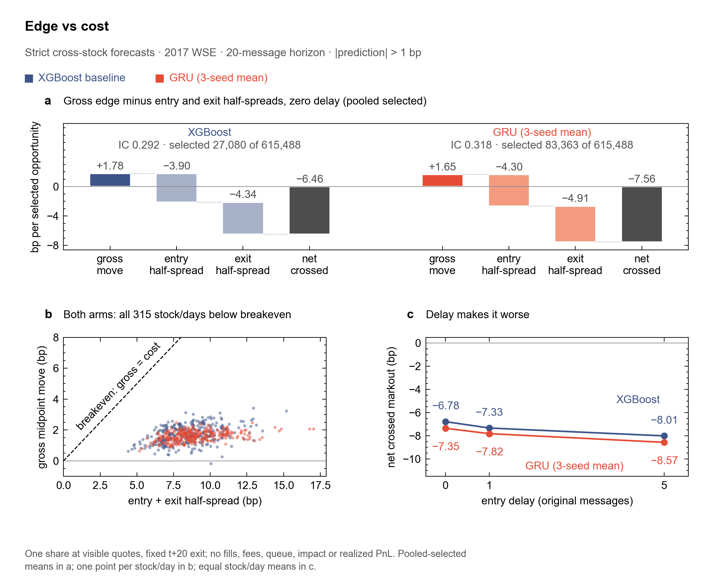

# Market Microstructure Lab


## Result in one screen

**Question:** Can an order-book forecast survive the cost of acting on it?



*Strict cross-stock forecasts on 2017 WSE equities. The models rank 20-message midpoint moves, but every stock/day loses after paying the visible spread, and delay makes it worse. Built by `scripts/render_edge_vs_cost.py` from committed aggregates.*

**Data:** [WSELOB-2017](https://data.mendeley.com/datasets/3g4mhdp899/1), five Warsaw Stock Exchange equities, 2017. 85,846,918 order messages are replayed into ten-level books, giving 56,887,949 feature rows. The feed holds order messages only and does not uniquely identify executions.

Each model was trained on four stocks and scored on the fifth, held-out stock (315 stock/days, 615,488 common opportunities). Trades fire when the forecast exceeds 1 bp.

| Result | XGBoost | GRU | Weighting |
| --- | ---: | ---: | --- |
| Ranking IC, GRU vs XGBoost, strict cross-stock folds | 0.292 | 0.318 | equal stock/day |
| Opportunities selected (forecast > 1 bp) | 27,080 | 83,363 | of 615,488 |
| Visible crossing at 0 / 1 / 5-message delay, net bp | −6.78 / −7.33 / −8.01 | −7.35 / −7.82 / −8.57 | equal stock/day |
| Cost split at zero delay: gross − entry − exit = net, bp | +1.78 − 3.90 − 4.34 = −6.46 | +1.65 − 4.30 − 4.91 = −7.56 | pooled selected |
| Same 19,043 opportunities selected by both, zero delay, net bp | −6.04 | −5.99 | pooled selected |
| Passive virtual-order fills (earlier Linear/XGBoost study, 20-message life): fill probability; 5-message post-fill midpoint change | 2.34%; −0.33 bp | – | equal stock/month |

Terms:

- **IC:** Spearman rank correlation between forecast and realized midpoint change. It is not a return.
- **Crossed markout:** buy at the visible ask (or sell at the bid), exit at the opposite visible quote 20 messages later, in bp of one share.
- **Equal stock/day vs pooled selected:** equal stock/day averages each stock/day cell once; pooled selected weights every selected opportunity once. The two can differ.
- **Passive fills:** with order messages alone, a delete may be a cancel or a fill, so the identified fill rate can be as low as zero. The fill probabilities above are conditional scenarios.

**Limits:** retrospective only; all evaluation dates and all five stocks were already exposed to the research process, so these results are not independently confirmed. Crossing results are quote arithmetic, not fills or PnL. One venue, one year, five stocks; no fees, impact or inventory.

**Go deeper:** [final package](docs/SEQUENCE_ML_FINAL_PACKAGE.md) · [limitations](docs/LIMITATIONS.md) · [computational environment](docs/COMPUTATIONAL_ENVIRONMENT.md) · [technology stack](docs/TECH_STACK.md) · [reproduce](#reproduce).

## Research arc

This reproducible research engine reconstructs 85.8M order messages from five **2017 Warsaw Stock Exchange equities**, compares causal midpoint forecasts, then tests visible crossing costs and conditional queue behavior.

**Prediction → validation → monetization test → execution friction → later-period confirmation.** A subsequent explanatory audit examines controls, feature increments and event timing on the already inspected sample.

## Data validity rules

From [methodology](docs/METHODOLOGY.md) and [source semantics](docs/WSELOB_QUEUE_SEMANTICS.md):

- Valid rows lie in the 10:00 (inclusive) to 16:00 (exclusive) Warsaw-time window.
- The book must be priced and uncrossed (not locked or crossed), with ten visible levels on each side.
- An F reset, an unpriced order, a locked/crossed book, insufficient ten-level depth, or a gap in valid original-message indices ends a valid segment.
- Features, labels, virtual orders and post-fill outcomes never cross a segment boundary or a day boundary.
- Order updates follow the depositor's documented reference code (`orderbook2.py`); the C++20 replay is byte-identical to the Python reference across all 85,846,918 messages.

## Reproduce

Headline figure and final package, from committed aggregates:

```bash
python3 -m venv .venv
. .venv/bin/activate
pip install -e ".[dev,ml,data,xgb,sequence]"
python scripts/render_edge_vs_cost.py
# Verifies receipt/parent/source/model hashes and writes a fresh manifest.
# Note: this script currently refuses to run unless the checkout is on the
# archived scientific task branch; see the final package.
python scripts/verify_sequence_ml_final.py --manifest-out /tmp/wse-scientific-manifest.json
```

Earlier-study audit tables and figures:

```bash
python -m pytest -q
cloblab demo --offline --out /tmp/microstructure-demo --rows 120
python scripts/render_research_audit.py
python scripts/verify_research_audit.py \
  --old-hashes results/wselob_research_audit_v1/old_result_hashes.json
```

Optional polars engine: `cloblab cache-summary --engine polars` scans the symbol/day Parquet feature cache lazily and must match the pandas reference on the same per-partition counts and microprice identity check (parity-tested; install with the `polars` extra).

The offline demo is **synthetic**. It does not reproduce the licensed study. Licensed preparation and actual plan/run/resume/aggregate commands are in [reproducibility](docs/REPRODUCIBILITY.md) and the [audit report](docs/SIGNAL_EXECUTION_DIAGNOSTICS_REPORT.md#reproduce-from-the-licensed-inputs). Raw events, row predictions and models remain private. Native speed ratios reuse the unchanged, verified core and measure kernels rather than end-to-end or live latency.

## History: earlier studies on the same data

These studies came before the sequence-ML package and use different cohorts and weightings. Their facts are unchanged.

### Linear vs XGBoost at a glance

| Evidence | Measured result and scope |
| --- | --- |
| Data | 85.8M licensed messages → 56.9M feature rows; five stocks, 1,250 stock/day partitions |
| Prediction | 20-message mean stock/month IC: XGBoost **0.262**, Linear **0.255** across four fixed months; modest uplift, 18/20 paired wins |
| Later-period confirmation | Preregistered Dec 27–29 check: XGBoost **0.274** vs. Linear **0.262**, leading on all five stocks |
| Visible execution cost | Strict \|prediction\| > 1 bp, 20 messages, zero delay: XGBoost crossed markout **−5.36 bp** in the original months and **−4.52 bp** in the later check |
| Conditional passive execution | Stronger signal tails were harder to fill; average five-message post-fill midpoint markouts were adverse |
| Explanatory audit | 150 fixed shuffled-label controls and 200 matched-feature cells; exact cost decomposition and original-message timing |
| Native engineering | C++20/pybind11 backend with byte-exact Python parity across 85.8M messages and 604.8M virtual-order evaluations; 8.98× replay / 3.57× queue kernel-level speedups on fixed workloads |
| Reproducibility | Content hashes, scientific task IDs, exact row matching, resumable checkpoints and strict task denominators |

IC is Spearman rank correlation, not a return. The later confirmation consists of only **three shared dates × five stocks**, with non-exposure partly supported by operator attestation. Its frozen full-history fit differs from the older monthly expanding-window study. These findings establish neither current-market alpha nor actual historical fills or trading profit. **Stronger-tail adverse-selection ordering did not consistently replicate**; stronger signals do not necessarily have worse post-fill markouts.

### Three views of the earlier result

| Question | Figure |
| --- | --- |
| How much do simple features explain, and what do extra features/models add? | [Signal sources](results/wselob_research_audit_v1/signal_sources.png) |
| Why does positive midpoint prediction fail the fixed crossing rule? | [Gross movement and visible spread costs](results/wselob_research_audit_v1/visible_costs.png) |
| How do prediction strength, conditional fills and post-fill value relate? | [Conditional execution](results/wselob_research_audit_v1/conditional_execution.png) |

The separate [formal historical sequence-ML package](docs/SEQUENCE_ML_FINAL_PACKAGE.md) adds matched-context, strict source-only stock-transfer and fixed visible-crossing checks. Its ranking gains did not survive visible spreads. The study is retrospective; all evaluation dates and stocks were exposed to the research process, so these results are not independently confirmed.

Read the **[signal and execution diagnostics report](docs/SIGNAL_EXECUTION_DIAGNOSTICS_REPORT.md)** for the completed explanatory audit. It preserves negative results and undefined metrics; it is not another unseen confirmation. Twenty messages span variable event seconds, not a fixed millisecond horizon. Passive spread diagnostics and conditional fills are not realized returns.

The original confirmation has separate [exposure audit](docs/LATER_PARTITIONS_UNTOUCHED_AUDIT.md), [preregistration](docs/LATER_PARTITIONS_CONFIRMATION_PROTOCOL.md) and [final report](docs/LATER_PARTITIONS_CONFIRMATION_REPORT.md). Earlier [prediction/engineering](docs/XGBOOST_SCALE_ENGINEERING_REPORT.md), [crossing](docs/EXECUTION_AWARE_ROBUSTNESS_REPORT.md), [queue](docs/QUEUE_AWARE_EXECUTION_REPORT.md) and [C++20](docs/CXX20_REPLAY_QUEUE_REPORT.md) reports retain their original experiments. See the [documentation index](docs/README.md) and [limitations](docs/LIMITATIONS.md).

## Publication scope

This public repository presents completed WSE research and its bounded retrospective sequence-ML package. Ongoing experiments and internal research planning are maintained separately. The historical sequence-ML results are retrospective; all evaluation dates and stocks were exposed to the research process, so these results are not independently confirmed; no current-market alpha is claimed.

## Data and current status

Source: [Marszałek, Adam (2023), WSELOB-2017, Mendeley Data V1](https://data.mendeley.com/datasets/3g4mhdp899/1), DOI 10.17632/3g4mhdp899.1, [CC BY 4.0](https://creativecommons.org/licenses/by/4.0/). Modifications include replay, causal features and aggregate research diagnostics. As-is; no warranty or endorsement. The retained Coinbase adapter is engineering-only, not the empirical benchmark. See [data terms](docs/DATA_TERMS.md) and [contribution/privacy policy](CONTRIBUTING.md).

The prediction, narrow later-period confirmation and explanatory audit are complete. The project is complete within its stated limits. Further model-zoo work on this inspected sample is low priority; empirical expansion should await longer genuinely uninspected data with clearer execution/cancellation information.
