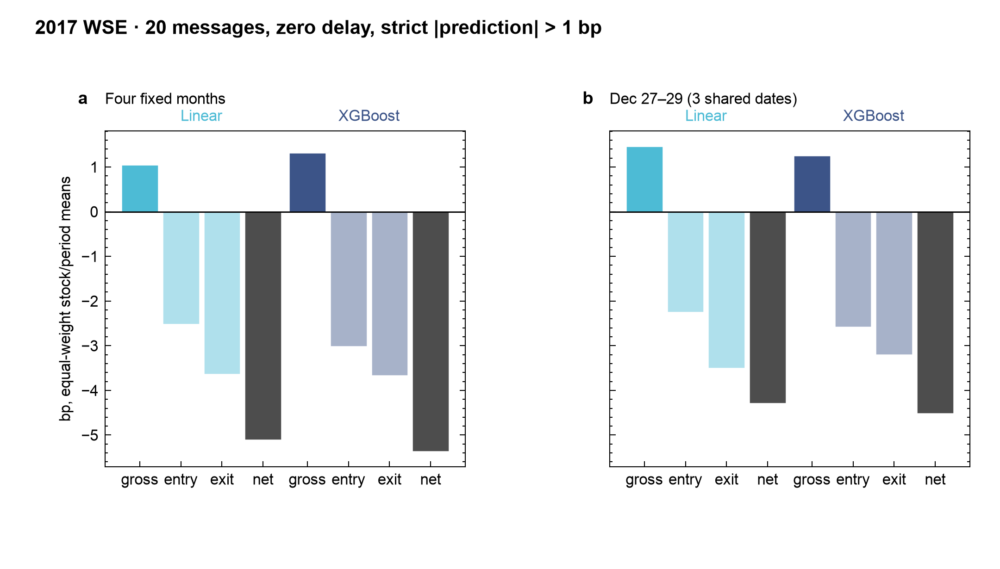

# Market Microstructure Lab


## Read this first

**Question:** Can an order-book forecast survive the cost of acting on it?



*Gross midpoint move vs entry/exit half-spreads at zero delay; crossed markout is negative in both periods. Equal-weight stock/period means.*

**Data:** [WSELOB-2017](https://data.mendeley.com/datasets/3g4mhdp899/1), five Warsaw Stock Exchange equities, 2017. 85,846,918 order messages are replayed into ten-level books, giving 56,887,949 feature rows. The feed holds order messages only and does not uniquely identify executions.

**Headline numbers** from the [formal sequence-ML package](docs/SEQUENCE_ML_FINAL_PACKAGE.md) (Q10/Q11 cohort: 315 stock/day cells, 615,488 common opportunities). This cohort differs from the "At a glance" study below. XGBoost here is the history XGBoost baseline; GRU is the mean of three seeds.

| Result | Weighting | Value |
| --- | --- | --- |
| Q10 source-only ranking IC, GRU vs XGBoost | equal stock/day | 0.318343 vs 0.291751 (+0.026592) |
| Q11 visible crossing, Q10 GRU, entry delay 0/1/5 messages | equal stock/day | −7.354 / −7.819 / −8.568 bp |
| Q11 visible crossing, Q10 XGBoost, entry delay 0/1/5 messages | equal stock/day | −6.781 / −7.332 / −8.012 bp |
| Q11 zero-delay cost split, Q10 GRU: gross move, entry half-spread, exit half-spread → crossed | pooled selected (83,363 opportunities) | +1.649, 4.296, 4.908 → −7.556 bp |
| Passive virtual orders, original XGBoost study, zero latency, 20-message life: fill probability; 5-message post-fill midpoint change | equal stock/month block | 2.3365%; −0.3335 bp |

**Limits:** retrospective only; all evaluation dates and all five stocks were already exposed to the research process, so these results are not independently confirmed. Crossing results are quote arithmetic, not fills or PnL; passive fills are conditional scenarios with a zero identified lower bound. One venue, one year, five stocks; no fees, impact or inventory.

**Go deeper:** [final package](docs/SEQUENCE_ML_FINAL_PACKAGE.md) · [limitations](docs/LIMITATIONS.md) · [computational environment](docs/COMPUTATIONAL_ENVIRONMENT.md). Reproduce the committed aggregates as in [Reproduce](#reproduce):

```bash
pip install -e ".[dev,ml,data,xgb,sequence]"
python scripts/render_research_audit.py
python scripts/verify_research_audit.py --old-hashes results/wselob_research_audit_v1/old_result_hashes.json
```

## Research arc

This reproducible research engine reconstructs 85.8M order messages from five **2017 Warsaw Stock Exchange equities**, compares causal midpoint forecasts, then tests visible crossing costs and conditional queue behavior.

**Prediction → validation → monetization test → execution friction → later-period confirmation.** A subsequent explanatory audit examines controls, feature increments and event timing on the already inspected sample.

## At a glance

| Evidence | Measured result and scope |
| --- | --- |
| Data | 85.8M licensed messages → 56.9M feature rows; five stocks, 1,250 stock/day partitions |
| Prediction | 20-message mean stock/month IC: XGBoost **0.262**, Linear **0.255** across four fixed months; modest uplift, 18/20 paired wins |
| Later-period confirmation | Preregistered Dec 27–29 check: XGBoost **0.274** vs. Linear **0.262**, leading on all five stocks |
| Visible execution cost | Strict \|prediction\| > 1 bp, 20 messages, zero delay: XGBoost crossed markout **−5.36 bp** in the original months and **−4.52 bp** in the later check |
| Conditional passive execution | Stronger signal tails were harder to fill; average five-message post-fill midpoint markouts were adverse |
| Explanatory audit | 150 fixed shuffled-label controls and 200 matched-feature cells; exact cost decomposition and original-message timing |
| **Native engineering** | C++20/pybind11 backend with byte-exact Python parity across 85.8M messages and 604.8M virtual-order evaluations; **8.98× replay / 3.57× queue kernel speedups** on fixed workloads |
| Reproducibility | Content hashes, scientific task IDs, exact row matching, resumable checkpoints and strict task denominators |

IC is Spearman rank correlation, not a return. The later confirmation consists of only **three shared dates × five stocks**, with non-exposure partly supported by operator attestation. Its frozen full-history fit differs from the older monthly expanding-window study. These findings establish neither current-market alpha nor actual historical fills or trading profit. **Stronger-tail adverse-selection ordering did not consistently replicate**; stronger signals do not necessarily have worse post-fill markouts.

## Three views of the result

| Question | Figure |
| --- | --- |
| How much do simple features explain, and what do extra features/models add? | [Signal sources](results/wselob_research_audit_v1/signal_sources.png) |
| Why does positive midpoint prediction fail the fixed crossing rule? | [Gross movement and visible spread costs](results/wselob_research_audit_v1/visible_costs.png) |
| How do prediction strength, conditional fills and post-fill value relate? | [Conditional execution](results/wselob_research_audit_v1/conditional_execution.png) |

The separate [formal historical sequence-ML package](docs/SEQUENCE_ML_FINAL_PACKAGE.md) adds matched-context, strict source-only stock-transfer and fixed visible-crossing checks. Its ranking gains did not survive visible spreads. The study is retrospective; all evaluation dates and stocks were exposed to the research process, so these results are not independently confirmed.

Read the **[signal and execution diagnostics report](docs/SIGNAL_EXECUTION_DIAGNOSTICS_REPORT.md)** for the completed explanatory audit. It preserves negative results and undefined metrics; it is not another unseen confirmation. Twenty messages span variable event seconds, not a fixed millisecond horizon. Passive spread diagnostics and conditional fills are not realized returns.

The original confirmation has separate [exposure audit](docs/LATER_PARTITIONS_UNTOUCHED_AUDIT.md), [preregistration](docs/LATER_PARTITIONS_CONFIRMATION_PROTOCOL.md) and [final report](docs/LATER_PARTITIONS_CONFIRMATION_REPORT.md). Earlier [prediction/engineering](docs/XGBOOST_SCALE_ENGINEERING_REPORT.md), [crossing](docs/EXECUTION_AWARE_ROBUSTNESS_REPORT.md), [queue](docs/QUEUE_AWARE_EXECUTION_REPORT.md) and [C++20](docs/CXX20_REPLAY_QUEUE_REPORT.md) reports retain their original experiments. See the [documentation index](docs/README.md) and [limitations](docs/LIMITATIONS.md).

## Reproduce

```bash
python3 -m venv .venv
. .venv/bin/activate
pip install -e ".[dev,ml,data,xgb,sequence]"
python -m pytest -q
cloblab demo --offline --out /tmp/microstructure-demo --rows 120
# Recreate the new tables and five figures from committed aggregates:
python scripts/render_research_audit.py
python scripts/verify_research_audit.py \
  --old-hashes results/wselob_research_audit_v1/old_result_hashes.json
```

The offline demo is **synthetic**. It does not reproduce the licensed study. Licensed preparation and actual plan/run/resume/aggregate commands are in [reproducibility](docs/REPRODUCIBILITY.md) and the [audit report](docs/SIGNAL_EXECUTION_DIAGNOSTICS_REPORT.md#reproduce-from-the-licensed-inputs). Raw events, row predictions and models remain private. Native speed ratios reuse the unchanged, verified core and measure kernels rather than end-to-end or live latency.

## Publication scope

This public repository presents completed WSE research and its bounded retrospective sequence-ML package. Ongoing experiments and internal research planning are maintained separately. The historical sequence-ML results are retrospective; all evaluation dates and stocks were exposed to the research process, so these results are not independently confirmed; no current-market alpha is claimed.

## Data and current status

Source: [Marszałek, Adam (2023), WSELOB-2017, Mendeley Data V1](https://data.mendeley.com/datasets/3g4mhdp899/1), DOI 10.17632/3g4mhdp899.1, [CC BY 4.0](https://creativecommons.org/licenses/by/4.0/). Modifications include replay, causal features and aggregate research diagnostics. As-is; no warranty or endorsement. The retained Coinbase adapter is engineering-only, not the empirical benchmark. See [data terms](docs/DATA_TERMS.md) and [contribution/privacy policy](CONTRIBUTING.md).

The prediction, narrow later-period confirmation and explanatory audit are complete. The project is scientifically mature within its stated limits. Further model-zoo work on this inspected sample is low priority; empirical expansion should await longer genuinely uninspected data with clearer execution/cancellation information.
