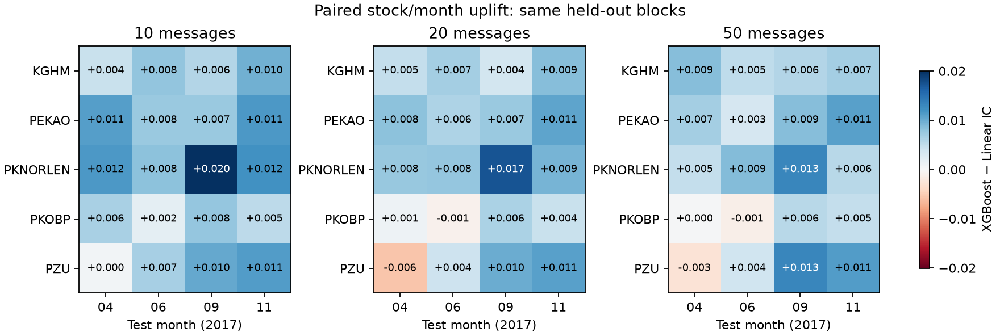
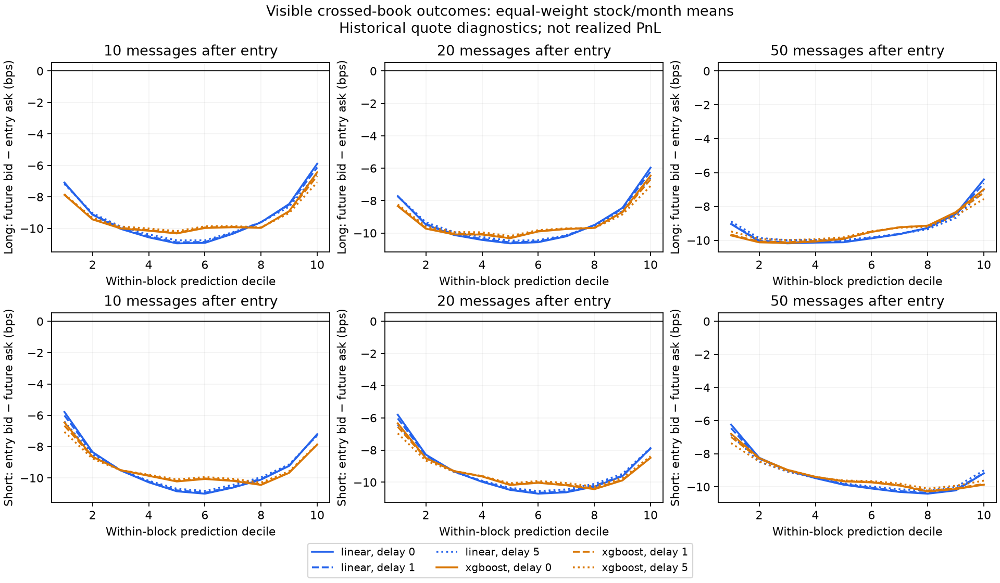
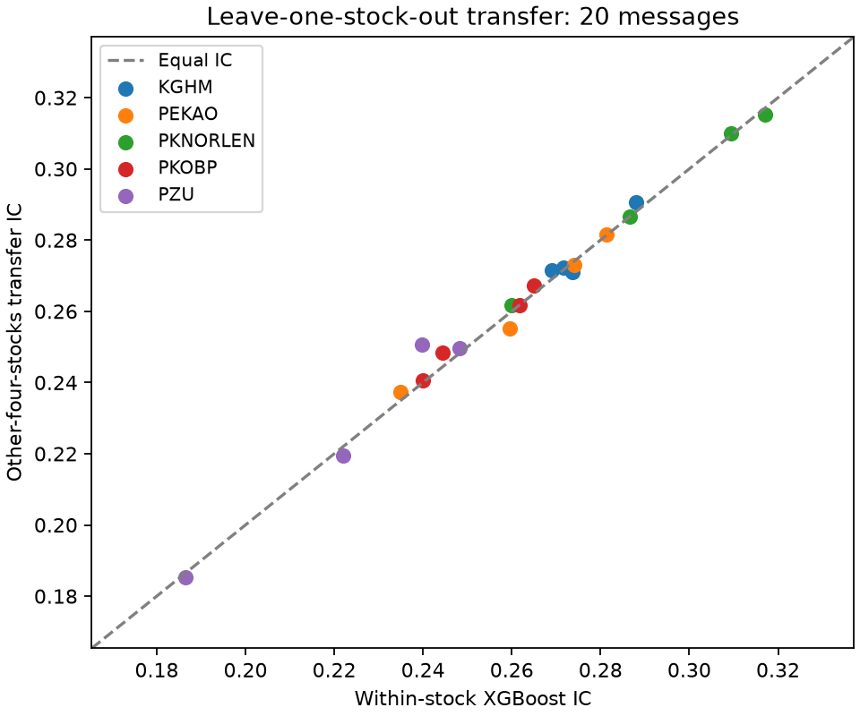

# Execution-Aware Robustness — WSELOB 2017

**Subsequent explanatory audit (2026-09-22):** [Signal and execution diagnostics](SIGNAL_EXECUTION_DIAGNOSTICS_REPORT.md) adds matched controls/features and clarifies execution accounting. This report retains its original experiment and results.

This report preserves the earlier April/June/September/November 2017 experiment. The separate completed [preregistered later-period confirmation](LATER_PARTITIONS_CONFIRMATION_REPORT.md) used a frozen full-history refit and three December dates. It confirmed the positive prediction ranking and negative primary crossed-book conclusion (20-message, zero-delay XGBoost: −4.52 bp under the fixed strict 1 bp rule). Its numbers and stock-period aggregation are separate from the historical tables below.

## Result

The small XGBoost improvement in midpoint IC survives the paired stock/month checks. It does **not** establish an executable trading edge: all primary model/horizon/latency headline top-decile long, bottom-decile short, and fixed-threshold crossed-book markouts are negative. Delay worsens the primary headline markouts. No primary block has the full expected ten-decile ordering after crossing.

These are historical visible-quote diagnostics, not realized PnL. A negative execution result is retained without changing the models, thresholds, holdouts, or latency grid.

## Completed scope

Phases 0–2: 137/137 reused prediction tasks and 411/411 execution cells completed. The prediction denominator is 60 Linear + 60 XGBoost + 17 shuffled-label XGBoost controls. No retraining was used for these phases. Existing published benchmark artifacts are unchanged.

Five stocks (KGHM, PKNORLEN, PKOBP, PZU, PEKAO), four fixed test months (April, June, September, November 2017), horizons 10/20/50 original messages, latency offsets 0/1/5 original messages. Models use the same five frozen causal features and expanding, strictly earlier training days.

## Paired midpoint robustness

| Horizon | Mean IC delta | Median delta | Wins / 20 | Descriptive 2.5% | Descriptive 97.5% |
| --- | --- | --- | --- | --- | --- |
| 10 | 0.008369 | 0.007819 | 20 | 0.006641 | 0.010234 |
| 20 | 0.006446 | 0.007171 | 18 | 0.004352 | 0.008438 |
| 50 | 0.006174 | 0.005720 | 18 | 0.004342 | 0.007987 |

Each observation is a paired stock/month IC difference, XGBoost minus Linear. The interval uses 10,000 resamples of the 20 paired blocks, seed 20260914. Shared stocks, months, and overlapping labels mean these blocks are not guaranteed independent. These are **descriptive robustness intervals**, not formal significance tests or row-count p-values.

All leave-one-stock and leave-one-month mean deltas remain positive. The minimum across each deletion family is:

| Horizon | Deletion family | Minimum retained mean delta |
| --- | --- | --- |
| 10 | leave_one_month | 0.007733 |
| 10 | leave_one_symbol | 0.007214 |
| 20 | leave_one_month | 0.005605 |
| 20 | leave_one_symbol | 0.005433 |
| 50 | leave_one_month | 0.005152 |
| 50 | leave_one_symbol | 0.005698 |

Per-stock, per-month, individual paired blocks, and every leave-one-out value are in [paired_model_robustness.csv](../results/wselob_execution_robustness_v1/paired_model_robustness.csv) and [paired_block_deltas.csv](../results/wselob_execution_robustness_v1/paired_block_deltas.csv).



## Crossed-book outcomes

At decision event t, entry uses the ask for a long and bid for a short at t+d. Exit uses the opposite quote at exactly t+d+h. Both outcomes use the entry midpoint as denominator:

```text
long_bps  = 10000 × (bid[t+d+h] − ask[t+d]) / midpoint[t+d]
short_bps = 10000 × (bid[t+d] − ask[t+d+h]) / midpoint[t+d]
```

All lookups stay inside the same stock, trading day, and uninterrupted valid book segment. Event gaps are rejected rather than interpreted as the next valid quote. The prediction remains fixed at t; future prices only define outcomes. Saved prediction checksums, timestamps, original event indices, and original midpoint labels must match the cached rows exactly.

For each stock/month/horizon, the intersection of valid rows across all three latencies is used for both models and all controls. Thus delay comparisons use identical rows, fixed predictions, fixed bins, and fixed threshold coverage. The common primary row counts per model are 16,845,687 / 16,804,885 / 16,693,438 at 10/20/50 messages. Removed tail rows and original denominators are recorded per task in run_manifest.json and block_metrics.csv.

The existing fixed threshold is strictly |prediction| > 1 bp. Positive predictions select long, negative predictions short; zero selects no direction. Coverage is the equal-weight mean of the 20 block coverage fractions, not a pooled fraction. Markouts are equal-weight block means, not row-weighted means.

### Zero-delay headline

| Model | Horizon | Top-decile long bps | Bottom-decile short bps | Threshold-selected bps | Threshold coverage fraction |
| --- | --- | --- | --- | --- | --- |
| linear | 10 | -5.891071 | -5.785583 | -7.909955 | 0.000073 |
| linear | 20 | -5.964479 | -5.806168 | -5.113115 | 0.024284 |
| linear | 50 | -6.407754 | -6.240842 | -6.517549 | 0.236410 |
| xgboost | 10 | -6.433696 | -6.455909 | -5.000174 | 0.019912 |
| xgboost | 20 | -6.458829 | -6.342141 | -5.363776 | 0.068745 |
| xgboost | 50 | -6.984892 | -6.796048 | -7.072217 | 0.242721 |

XGBoost's larger midpoint IC does not make it a universal winner under crossing. Its threshold-selected zero-delay result improves on Linear at 10 messages, but is worse at 20 and 50 messages. The two models select different subsets under the same 1 bp rule; coverage is therefore reported alongside this conditional comparison. Both are evaluated on the same eligible base rows.

### Delay sensitivity

| Model | Horizon | Delay (messages) | Threshold-selected bps | Fraction fully ordered |
| --- | --- | --- | --- | --- |
| linear | 10 | 0 | -7.909955 | 0.000000 |
| linear | 10 | 1 | -8.760893 | 0.000000 |
| linear | 10 | 5 | -9.500167 | 0.000000 |
| linear | 20 | 0 | -5.113115 | 0.000000 |
| linear | 20 | 1 | -5.839438 | 0.000000 |
| linear | 20 | 5 | -6.209673 | 0.000000 |
| linear | 50 | 0 | -6.517549 | 0.000000 |
| linear | 50 | 1 | -6.719396 | 0.000000 |
| linear | 50 | 5 | -7.083173 | 0.000000 |
| xgboost | 10 | 0 | -5.000174 | 0.000000 |
| xgboost | 10 | 1 | -5.914086 | 0.000000 |
| xgboost | 10 | 5 | -6.519487 | 0.000000 |
| xgboost | 20 | 0 | -5.363776 | 0.000000 |
| xgboost | 20 | 1 | -5.818927 | 0.000000 |
| xgboost | 20 | 5 | -6.371265 | 0.000000 |
| xgboost | 50 | 0 | -7.072217 | 0.000000 |
| xgboost | 50 | 1 | -7.248325 | 0.000000 |
| xgboost | 50 | 5 | -7.591174 | 0.000000 |

Deciles use within-block prediction quantiles with equal predictions kept together. Full expected ordering requires all nine adjacent long differences to be nonnegative and all nine short differences nonpositive. It holds in 0/20 primary blocks for every horizon and latency. This strict measure does not imply there is no local relation between prediction and outcome. The full curves show the spread-dependent shape.



Absolute latency changes are in [latency_summary.csv](../results/wselob_execution_robustness_v1/latency_summary.csv); paired Linear/XGBoost differences on identical eligible rows are in [paired_execution_differences.csv](../results/wselob_execution_robustness_v1/paired_execution_differences.csv).

## Negative controls

All 17 original shuffled-label controls were reused: all five stocks in June at three horizons, seed 7, plus PEKAO June 20-message seeds 17 and 29. All control cells lack full decile ordering. None selects any observation under the fixed 1 bp threshold, so selected markout is **undefined**, not zero. Aggregate extreme-decile crossed outcomes are negative. There is no retained control success requiring a stronger-claim investigation; the primary execution conclusion remains negative.

| Horizon | Seed | Blocks | Top long bps | Bottom short bps | Selected rows |
| --- | --- | --- | --- | --- | --- |
| 10 | 7.000000 | 5 | -11.087182 | -12.411934 | 0 |
| 20 | 7.000000 | 5 | -11.340125 | -11.225427 | 0 |
| 20 | 17.000000 | 1 | -10.310584 | -6.796930 | 0 |
| 20 | 29.000000 | 1 | -9.551747 | -7.653608 | 0 |
| 50 | 7.000000 | 5 | -10.569651 | -10.641184 | 0 |

## Scientific identity and reproducibility

Version-2 scientific task IDs include dataset/session definitions, features, split and metric rules, model hyperparameters, control seeds, scientific outcome settings, and content hashes of input partitions. Device, worker count, paths, telemetry, runtime limits, and publication settings are excluded. Cache manifests created by the updated pipeline use the same scientific config view. Legacy caches and prediction receipts retain their original identities as immutable provenance; the new experiment checks their content and row identity explicitly. Source hashes are recorded separately from task identity.

Only aggregate artifacts and input checksums are public. Raw data, row-level predictions, private checkpoint folders, and local telemetry remain outside Git. Reuse requires the original private prediction receipts and matching licensed cache; alternatively regenerate the baseline with its frozen scientific settings and retain its original row identities. This version's reuse runner deliberately requires the published legacy task IDs, so a fresh baseline must supply its own matching metrics and prediction receipts rather than pretending to reproduce the original device's exact numerical predictions.

```bash
PYTHONPATH=src python scripts/run_execution_robustness.py \
  --config configs/wselob_execution_robustness_v1.json \
  --metrics results/wselob_xgboost_application_v1/model_metrics_by_symbol_month.csv \
  --cache "$CACHE" --prediction-roots "$LINEAR_RUNS" "$XGBOOST_RUNS" \
  --work "$PRIVATE_CHECKPOINTS" --out results/wselob_execution_robustness_v1
python scripts/render_execution_robustness.py
```

[run_manifest.json](../results/wselob_execution_robustness_v1/run_manifest.json) binds each reused prediction file to the new scientific task ID and records complete denominators. Checkpoint reuse requires unchanged scientific settings, input hashes, prediction hashes, and analysis implementation. Incomplete or mismatched tasks fail aggregation.

## Validation

The implementation passed 60 local tests. Coverage includes hand-calculated long/short formulas, exact latency indices, day/segment boundaries, execution-independent scientific IDs, changed scientific settings, matching paired blocks, incomplete denominators, and transfer chronology/held-out-stock exclusion. The public privacy check passed. The implementation CI passed on Python 3.10 and 3.12; subsequent publication commits run the same workflow. No numerical significance or real trading claim is inferred from these software checks.

## Optional stock transfer

The pooled-other-stock model retains comparable midpoint IC: 0.262463 versus 0.261639 within-stock, a mean difference of +0.000824, with 13/20 block wins. This is a small descriptive difference, not evidence that transfer is universally better. The June shuffled transfer control averages 0.066518 IC: substantially weaker, but not zero. No significance is inferred from the row count.

Phase 3 completed 20 primary tasks and five June shuffled-label controls at the fixed 20-message horizon. Each task trains on strictly earlier data from the other four stocks, using the original five features and XGBoost hyperparameters. Controls shuffle within each training stock/day with seed 7. Test row identities and labels match the original within-stock comparator exactly. No model or threshold tuning was performed.

| Scope | Member | Control seed | Blocks | Transfer IC | Within-stock IC | Transfer minus within | Wins |
| --- | --- | --- | --- | --- | --- | --- | --- |
| overall | all | 7.000000 | 5 | 0.066518 | 0.268427 | -0.201908 | 0 |
| by_symbol | KGHM | 7.000000 | 1 | 0.072831 | 0.271640 | -0.198809 | 0 |
| by_symbol | PEKAO | 7.000000 | 1 | 0.083934 | 0.274121 | -0.190187 | 0 |
| by_symbol | PKNORLEN | 7.000000 | 1 | 0.060391 | 0.309468 | -0.249077 | 0 |
| by_symbol | PKOBP | 7.000000 | 1 | 0.063622 | 0.264954 | -0.201331 | 0 |
| by_symbol | PZU | 7.000000 | 1 | 0.051813 | 0.221951 | -0.170138 | 0 |
| by_month | 2017-06 | 7.000000 | 5 | 0.066518 | 0.268427 | -0.201908 | 0 |
| overall | all | NA | 20 | 0.262463 | 0.261639 | 0.000824 | 13 |
| by_symbol | KGHM | NA | 4 | 0.276408 | 0.275594 | 0.000814 | 3 |
| by_symbol | PEKAO | NA | 4 | 0.261795 | 0.262476 | -0.000682 | 2 |
| by_symbol | PKNORLEN | NA | 4 | 0.293375 | 0.293281 | 0.000094 | 2 |
| by_symbol | PKOBP | NA | 4 | 0.254451 | 0.252760 | 0.001691 | 4 |
| by_symbol | PZU | NA | 4 | 0.226287 | 0.224085 | 0.002201 | 2 |
| by_month | 2017-04 | NA | 5 | 0.262408 | 0.259848 | 0.002561 | 3 |
| by_month | 2017-06 | NA | 5 | 0.268450 | 0.268427 | 0.000023 | 3 |
| by_month | 2017-09 | NA | 5 | 0.279793 | 0.279306 | 0.000487 | 4 |
| by_month | 2017-11 | NA | 5 | 0.239200 | 0.238976 | 0.000224 | 3 |



Transfer is a midpoint prediction diagnostic. It does not overturn the negative crossed-book results above. Primary and shuffled transfer denominators are separate; the control comparison is descriptive.

## Limits and attribution

Visible-quote crossing excludes fees/rebates, hidden liquidity, fills, queue position, impact, and inventory constraints. Event latency is measured in messages, not a fixed number of milliseconds. Holdout blocks were already used in the published benchmark; this robustness extension is not a new untouched confirmation sample. The findings concern five Polish equities in 2017, not current crypto-market profitability.

Source: Marszałek, Adam (2023), WSELOB-2017, Mendeley Data V1, DOI 10.17632/3g4mhdp899.1, CC BY 4.0. Modifications: reconstructed book features, frozen predictions, paired robustness and crossed-book aggregation. Provided as-is; no endorsement. See [license and source details](WSELOB_LICENSE.md).
