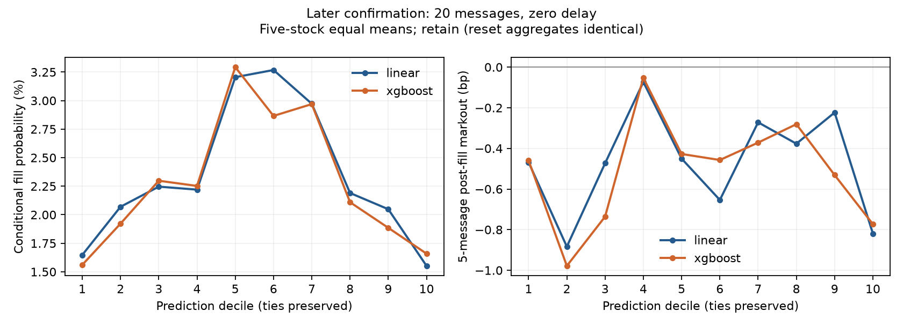

# Later-period confirmation under a frozen full-history refit

## Answer to the preregistered questions

- **Q1 — Prediction: replicated within this later period.** At 20 messages, five-stock mean Spearman IC is **0.261719730 for Linear and 0.274159482 for XGBoost**. The paired mean gain is **0.012439752**, positive for all five stocks. Each individual date also has positive ranking and a positive mean model difference.
- **Q2 — Aggressive monetization: the negative conclusion replicated.** At zero latency and the fixed 1 bp selection rule, crossed-book markouts are **−4.293353209 bp for Linear and −4.519463312 bp for XGBoost**. Better midpoint ranking still does not survive paying the visible spread in the headline diagnostic.
- **Q3 — Passive execution: the fill trade-off and adverse post-fill headline replicated, with heterogeneous tail adverse-selection contrasts.** Both prediction tails have lower conditional fill probability than the central bins in every stock for both models. XGBoost's five-message post-fill markout is **−0.456027291 bp**. Tail-versus-center adverse-selection differences vary by stock; the result does not establish a universal monotonic relationship or an execution advantage for XGBoost.

These are a **pre-registered later-period confirmation set** and a **later-period confirmation under a frozen full-history refit**, not an exact numerical replication of the earlier monthly expanding folds. Non-exposure partly relies on operator attestation; label-bearing prepared caches existed. The set was not cryptographically blinded or independently proven never-seen.

## Completion, dates and denominators

All **35/35 fits** completed: 30 primary fits and five seed-7 XGBoost controls. Every model was trained once on its own stock's eligible history through **2017-12-22**, with no confirmation-period refit or cross-stock pooling. The five features, model parameters, horizons, thresholds, latency grid, queue assumptions and aggregation rules remained frozen. No implementation bug or scientific-code correction occurred after reveal.

All 15 planned partitions remained included: **5 symbols × 3 shared calendar dates, not 15 independent time periods**. Source inputs contain **783,888 messages**, yielding **486,748 prepared rows**. Counts below are inventory or eligibility denominators, not independent observations.

| symbol | day | raw_messages | snapshot_rows |
| --- | --- | --- | --- |
| KGHM | 2017-12-27 | 45386 | 22405 |
| KGHM | 2017-12-28 | 53900 | 35101 |
| KGHM | 2017-12-29 | 43913 | 29710 |
| PEKAO | 2017-12-27 | 26704 | 13613 |
| PEKAO | 2017-12-28 | 28217 | 16347 |
| PEKAO | 2017-12-29 | 22370 | 13053 |
| PKNORLEN | 2017-12-27 | 42842 | 29566 |
| PKNORLEN | 2017-12-28 | 54745 | 27594 |
| PKNORLEN | 2017-12-29 | 53874 | 41023 |
| PKOBP | 2017-12-27 | 38297 | 22639 |
| PKOBP | 2017-12-28 | 61201 | 37734 |
| PKOBP | 2017-12-29 | 62425 | 42187 |
| PZU | 2017-12-27 | 139549 | 82706 |
| PZU | 2017-12-28 | 54595 | 34943 |
| PZU | 2017-12-29 | 55870 | 38127 |

| horizon | feature_rows | excluded_nonfinite_features | excluded_label_after_features | eligible_rows |
| --- | --- | --- | --- | --- |
| 10 | 486748 | 204 | 1746 | 484798 |
| 20 | 486748 | 204 | 3237 | 483307 |
| 50 | 486748 | 204 | 6962 | 479582 |

At the primary horizon, both models and the control use **483,307** eligible prediction rows. The aggressive common-latency intersection retains **482,620**, excluding another **687** rows. The zero-delay queue uses **483,307** eligible decisions. All 35 stock-period prediction blocks / 105 stock-day blocks, 105 aggressive stock-period cells / 315 stock-day cells, and 210 queue stock-period cells / 630 stock-day cells are present, including controls. Undefined metrics remain in the tables.

`partition_inventory.csv` additionally records replay action and exclusion counts; `eligibility.csv` gives each stock/day/horizon's feature and label exclusions. `manifest.json` records historical training denominators, hashes, task identity, fitted-once receipts and software versions. Training rows overlap and are reused across fits; adding them across models would not create a meaningful independent-sample count.

## Q1 — Primary prediction

Each row combines the three dates for that stock before computing rank correlation. The headline then averages five stock metrics equally. It is neither pooled across stocks nor an average of daily ICs.

| symbol | linear | xgboost | delta |
| --- | --- | --- | --- |
| KGHM | 0.268146074 | 0.276970420 | 0.008824346 |
| PEKAO | 0.237823303 | 0.253893406 | 0.016070104 |
| PKNORLEN | 0.293194718 | 0.308628216 | 0.015433498 |
| PKOBP | 0.262958370 | 0.272908967 | 0.009950597 |
| PZU | 0.246476184 | 0.258396402 | 0.011920218 |

Equal-weight Linear IC: **0.261719729694**. Equal-weight XGBoost IC: **0.274159482183**. Mean paired delta: **0.012439752490**; median delta: **0.011920217800**; strict-positive wins: **5/5**; defined paired blocks: **5/5**. No p-value or confidence interval is calculated.

### Secondary horizons

| horizon | linear | xgboost | delta |
| --- | --- | --- | --- |
| 10 | 0.236651217 | 0.249753949 | 0.013102732 |
| 20 | 0.261719730 | 0.274159482 | 0.012439752 |
| 50 | 0.257223330 | 0.270630086 | 0.013406756 |

The 20-message horizon remains primary. Secondary horizons do not replace it.

### Separate-date diagnostics

These are equal-weight means of the five stock-day ICs on each date. They are descriptive, not three independent replications. The three-date stock-period IC need not equal the average of these daily values.

| day | linear | xgboost | delta |
| --- | --- | --- | --- |
| 2017-12-27 | 0.293958713 | 0.306331671 | 0.012372959 |
| 2017-12-28 | 0.265196809 | 0.276374875 | 0.011178065 |
| 2017-12-29 | 0.234218760 | 0.247565708 | 0.013346949 |

All 15 stock-day XGBoost-minus-Linear differences are positive, but the 15 observations share stocks and dates. This count supplies no formal significance claim. Individual stock-day values remain in `prediction.csv`.

## Q2 — Aggressive visible crossing

Primary: **20 messages / zero latency / strict |prediction| > 1 bp**. Both models share identical eligible decision rows across all three latencies. Longs enter at the ask and exit at the future bid; shorts enter at the bid and exit at the future ask, using the entry midpoint denominator.

Counts are summed across stocks; rates and markouts are equal-weight means of five stock-period metrics. Consequently coverage is not selected-total divided by eligible-total.

| model | rows_total | selected_rows_total | coverage | sign_selected_bps | top_decile_long_bps | bottom_decile_short_bps | decile_bins | ordered_deciles |
| --- | --- | --- | --- | --- | --- | --- | --- | --- |
| linear | 482620 | 12721 | 0.039096893 | -4.293353209 | -5.361908049 | -5.403407565 | 10.000000000 | 0.000000000 |
| xgboost | 482620 | 33677 | 0.084307255 | -4.519463312 | -5.655822574 | -5.511703069 | 10.000000000 | 0.000000000 |

All five primary blocks have ten actual bins; the ordering diagnostic is zero (0/5 ordered blocks) for each model. Prediction bin assignments are held fixed across latency settings and retained for daily slices. These are historical visible-quote diagnostics, not realized P&L, actual fills or measured live slippage.

### Secondary aggressive grid

| horizon | latency | model | coverage | sign_selected_bps |
| --- | --- | --- | --- | --- |
| 10 | 0 | linear | 0.000199963 | undefined |
| 10 | 1 | linear | 0.000199963 | undefined |
| 10 | 5 | linear | 0.000199963 | undefined |
| 10 | 0 | xgboost | 0.022500478 | -4.382619424 |
| 10 | 1 | xgboost | 0.022500478 | -5.176897684 |
| 10 | 5 | xgboost | 0.022500478 | -5.666953780 |
| 20 | 0 | linear | 0.039096893 | -4.293353209 |
| 20 | 1 | linear | 0.039096893 | -6.184914250 |
| 20 | 5 | linear | 0.039096893 | -6.437771805 |
| 20 | 0 | xgboost | 0.084307255 | -4.519463312 |
| 20 | 1 | xgboost | 0.084307255 | -4.926715814 |
| 20 | 5 | xgboost | 0.084307255 | -5.427258943 |
| 50 | 0 | linear | 0.247861524 | -5.741696347 |
| 50 | 1 | linear | 0.247861524 | -5.921289405 |
| 50 | 5 | linear | 0.247861524 | -6.251475154 |
| 50 | 0 | xgboost | 0.258285024 | -6.259268145 |
| 50 | 1 | xgboost | 0.258285024 | -6.426427272 |
| 50 | 5 | xgboost | 0.258285024 | -6.743721911 |

The primary crossed-book headline becomes more negative with 1- and 5-message delay. The 10-message Linear selected-markout headline is **undefined**, not zero: PKOBP has no selected rows. Its other stock counts are KGHM 28, PEKAO 28, PKNORLEN 2 and PZU 1; the single PZU selection has zero zero-delay markout. We do not drop PKOBP, report a four-stock mean, or claim every individual cell is strictly negative. Full stock/day/bin values and actual bin counts are in `aggressive.csv` and `aggressive_deciles.csv`.

## Q3 — Conditional passive queue diagnostics

Primary: **20 messages / zero latency**, retaining both priority interpretations. The virtual order is one dataset-native displayed unit at the back of the best bid or ask according to signal sign, without repricing. D removals and same-price M reductions are treated as executions only within the stated conditional scenario. Queue-ahead removal alone cannot fill the virtual unit. Adverse movement, race handling, segment barriers and post-fill offsets use the unchanged Python reference.

Counts are totals; fill probability and fill-before-adverse are equal-weight means of five stock rates, each using **all eligible decisions**, including zero signals. Mean fill time is an equal-weight mean of stock-level conditional means, in messages. Post-fill metrics use their own observable filled samples.

| model | interpretation | eligible_decisions_total | zero_signal_decisions_total | placed_orders_total | fills_total | fill_probability | fill_before_adverse | mean_fill_time | markout_5 | spread_5 | markout_5_observations_total | spread_5_observations_total |
| --- | --- | --- | --- | --- | --- | --- | --- | --- | --- | --- | --- | --- |
| linear | reset | 483307 | 0 | 483307 | 10155 | 0.023418835 | 0.019051354 | 14.130546327 | -0.437077877 | 4.132283887 | 10155 | 10155 |
| linear | retain | 483307 | 0 | 483307 | 10155 | 0.023418835 | 0.019051354 | 14.130546327 | -0.437077877 | 4.132283887 | 10155 | 10155 |
| xgboost | reset | 483307 | 0 | 483307 | 9927 | 0.022815290 | 0.018683662 | 14.161472450 | -0.456027291 | 4.110762021 | 9927 | 9927 |
| xgboost | retain | 483307 | 0 | 483307 | 9927 | 0.022815290 | 0.018683662 | 14.161472450 | -0.456027291 | 4.110762021 | 9927 | 9927 |

All five primary stock blocks have defined five-message markout and spread means. Each primary five-message post-fill denominator equals its conditional fill count here; other offsets' separate observable counts are retained in `passive.csv`. The entire retain/reset aggregate tables coincide, which does not identify actual exchange priority or resolve cancellation/execution ambiguity. The identified lower fill bound remains zero, with undefined conditional markout.

### Stronger-signal tails

The figure uses strict five-stock means for each bin; an undefined contributor would leave a gap. It shows retain; reset aggregate values coincide. Full per-stock and daily prediction-bin curves are in `passive_deciles.csv`; queue-ahead curves are in `queue_deciles.csv`. Ties are preserved and duplicate quantile edges are dropped.

The preregistered contrast subtracts the equally weighted means of bins 5 and 6 from each outer bin. The fill-probability differences below are percentage points; markouts are basis points.

| model | tail_bin | fill_difference_pp | markout_5_tail_minus_center |
| --- | --- | --- | --- |
| linear | 1 | -1.589266002 | 0.083915165 |
| linear | 10 | -1.684707288 | -0.266917131 |
| xgboost | 1 | -1.518837401 | -0.017092500 |
| xgboost | 10 | -1.420861351 | -0.330592598 |

Every one of the 20 stock/model/tail fill-probability contrasts is negative. This supports the signal-strength/fill-probability tension in this sample. However, post-fill tail contrasts have both signs across stocks; for example, some PKNORLEN and PKOBP tails are less adverse than their centers. XGBoost's mean lower-tail contrast is close to zero. Thus the adverse average after filling replicates, while a universal stronger-tail/worse-markout ordering is not supported.

### Secondary queue grid

Retain is displayed to avoid duplicating identical reset values; both remain in every public table.

| horizon | latency | model | eligible_decisions_total | fill_probability | markout_5 | spread_5 |
| --- | --- | --- | --- | --- | --- | --- |
| 10 | 0 | linear | 484798 | 0.005170244 | -0.123768196 | 4.515722076 |
| 10 | 1 | linear | 484798 | 0.006134421 | -0.118839910 | 4.468494139 |
| 10 | 5 | linear | 484798 | 0.007937679 | -0.244388711 | 4.111597482 |
| 10 | 0 | xgboost | 484798 | 0.004888185 | -0.201942089 | 4.453387811 |
| 10 | 1 | xgboost | 484798 | 0.005705436 | -0.193034523 | 4.340677608 |
| 10 | 5 | xgboost | 484798 | 0.007557891 | -0.252320997 | 4.131038818 |
| 20 | 0 | linear | 483307 | 0.023418835 | -0.437077877 | 4.132283887 |
| 20 | 1 | linear | 483307 | 0.025369850 | -0.408295137 | 4.161461443 |
| 20 | 5 | linear | 483307 | 0.029216636 | -0.408208800 | 4.003866415 |
| 20 | 0 | xgboost | 483307 | 0.022815290 | -0.456027291 | 4.110762021 |
| 20 | 1 | xgboost | 483307 | 0.024667394 | -0.431468132 | 4.150292250 |
| 20 | 5 | xgboost | 483307 | 0.029005075 | -0.416427097 | 4.015533601 |
| 50 | 0 | linear | 479582 | 0.099664241 | -0.621759787 | 4.149120038 |
| 50 | 1 | linear | 479582 | 0.103154767 | -0.605155303 | 4.163715876 |
| 50 | 5 | linear | 479582 | 0.112038332 | -0.589086396 | 4.137634804 |
| 50 | 0 | xgboost | 479582 | 0.099535280 | -0.625278195 | 4.210098254 |
| 50 | 1 | xgboost | 479582 | 0.102693001 | -0.611642792 | 4.209030589 |
| 50 | 5 | xgboost | 479582 | 0.111941181 | -0.588972943 | 4.175410539 |

Longer lifetimes and placement delays increase conditional fill rates in these headlines. The 20-message spread diagnostic is **not monotonically decreasing** with delay: it rises slightly at delay 1 and falls at delay 5. The earlier broadly negative latency interpretation must not be turned into a universal monotonic passive-spread rule. At zero delay, XGBoost has slightly lower fill probability and a slightly worse spread diagnostic than Linear despite its better midpoint IC. These models select different directions and filled subsets, so this is not a causal execution comparison.

## Frozen negative control

Five own-stock XGBoost fits use only historical labels shuffled within training day, seed 7, at horizon 20. They use the same confirmation period and row eligibility. No control outcome changes the experiment definition.

| model | control_seed | ic | n_test_total |
| --- | --- | --- | --- |
| xgboost | 7.000000000 | 0.041452255 | 483307 |

| model | control_seed | rows_total | selected_rows_total | coverage | sign_selected_bps | top_decile_long_bps | bottom_decile_short_bps |
| --- | --- | --- | --- | --- | --- | --- | --- |
| xgboost | 7.000000000 | 482620 | 0 | 0.000000000 | undefined | -8.111935767 | -10.868897346 |

| model | control_seed | eligible_decisions_total | fills_total | fill_probability | fill_before_adverse | markout_5 | spread_5 |
| --- | --- | --- | --- | --- | --- | --- | --- |
| xgboost | 7.000000000 | 483307 | 19361 | 0.043006892 | 0.033046349 | -0.421391987 | 3.350863796 |

The control mean IC is positive but far below the primary models. It selects no observations under the fixed 1 bp threshold, making selected crossed-book markout undefined. Its conditional passive-price spread diagnostic remains positive despite shuffled training labels. This again shows why a positive passive-price diagnostic is not proof of predictive alpha or profit. A single shuffle seed is a diagnostic, not a null sampling distribution.

## Comparison with the previous study

| Finding | Previous study | Later confirmation | Interpretation |
| --- | --- | --- | --- |
| Midpoint prediction | 20-message Linear 0.255193; XGBoost 0.261639 | Linear 0.261720; XGBoost 0.274159 | Replicated positive ranking; different training and block aggregation |
| XGBoost vs Linear | Mean delta 0.006446; 18/20 monthly-block wins | Mean delta 0.012440; 5/5 stock-period wins | Positive modest advantage replicated; no formal significance |
| Aggressive crossing | XGBoost selected -5.363776300 bp at h20/d0 | XGBoost selected -4.519463 bp at h20/d0 | Negative headline replicated; magnitude less negative |
| Passive fill pattern | Stronger prediction tails had lower conditional fill probability | Both tails lower than bins 5/6 in every stock for both models | Replicated within these three dates |
| Post-fill adverse selection | XGBoost five-message markout -0.333498 bp | XGBoost five-message markout -0.456027 bp | Adverse headline replicated; tail-center contrasts heterogeneous |
| XGBoost passive-price advantage | Five-message spread diagnostic about 0.0981 bp above Linear | Five-message spread diagnostic 0.021522 bp below Linear | Relative advantage reversed; not causal execution or P&L |

The previous study averaged stock/month blocks from four monthly expanding folds. This study averages five stock-level blocks after a single full-history refit through December 22. The confirmation period is later, short and concentrated at year end. Neither the larger IC difference nor the less negative crossing number can be attributed causally to more training data, a better regime or a model improvement. No new features, settings or threshold were selected.

## Evidence, limitations and claim gate

- Only three shared calendar dates in five 2017 WSE equities: not broad temporal replication, current-market alpha or universal cross-market evidence.
- Historical non-exposure partly relies on operator attestation. Label-bearing caches existed; this was not a cryptographic blind or independently proven never-seen holdout.
- Overlapping message-horizon labels and shared stocks/dates are dependent. No formal significance or independent-sample claim from 15 partitions, 483,307 eligible rows or the positive win count.
- This is confirmation under a frozen full-history refit, not exact numerical replication of monthly expanding folds. Event horizons and delays are message counts, not fixed milliseconds.
- Visible crossing excludes fees/rebates, impact, hidden liquidity, inventory and actual fills. It is not realized P&L or a complete live trading-cost model.
- Nonzero passive fills are conditional historical scenario outputs, not identified actual or live fills. Cancellation/execution ambiguity and priority uncertainty remain. Positive realized-spread diagnostics are not realized profit.
- Filled samples differ across model directions; no causal execution advantage follows. Tail post-fill heterogeneity and the non-monotonic passive spread/latency result remain visible.
- Undefined metrics stay undefined. The 10-message Linear threshold headline and threshold-selected control markouts are not silently imputed or averaged over fewer stocks.

## Application-facing verdict

**UPGRADE SUPPORTED** — narrowly: the project now has a preregistered later-period check supporting its prediction-versus-execution research arc. This does not support stronger profitability, independence, live-execution or broad-replication wording.

Candidate resume bullet (proposal only; no resume edited):

> Validated frozen Linear/XGBoost signals on a preregistered later period across five equities (three shared dates): XGBoost IC 0.274 vs. Linear 0.262, while fixed-threshold crossed-book markouts remained negative and conditional queue diagnostics exposed fill/adverse-selection trade-offs.

Interview interpretation: I froze both models before a later three-day period rather than retuning on the answer. The midpoint ranking persisted, but paying the visible spread still produced negative selected markouts, so I would not interpret the IC improvement as tradable profit. Passive orders faced lower conditional fill probability in stronger signal tails and adverse average post-fill price movement. The better predictor also did not consistently deliver better passive-price diagnostics, which changes how I would prioritize execution research. I would next seek a materially longer untouched period and execution-identified data before making production or profitability claims.

## Reproduction and validation record

Audit commit: `e82a75de2ed02d8bf6f3f84fd602dc9b13ddcc81`.
Preregistration commit: `7d5671612ecf286da2690d5747658d09b0474529`.
Pre-reveal implementation/tests commit: `03bae38c8d2a3917346aff4204df774ea3f8a748`.
Pre-reveal synthetic privacy-sentinel spelling adjustment: `10f586655641642176eff512b062209b860b8ac6` (no scientific-code change).

Before reveal, **62 targeted tests passed**, including 13 confirmation tests, existing execution/queue semantics, a synthetic end-to-end task, and resume/no-refit behavior. The final spelling-only test adjustment passed all 13 confirmation tests and the publication privacy scan. Tests used synthetic inputs, not the later scientific outcomes.

The real run completed all 35 tasks before aggregate inspection, and both bounded execution streams exited successfully. The frozen aggregator enforced complete task/cell denominators, matched model row identities and unchanged source/cache hashes. All 13 runner-generated CSV hashes and the 35 one-fit receipts were verified after retrieval. All 16 new text artifacts, including the large decile tables and manifest, passed the publication privacy scan. Original replay regenerated the confirmation snapshots and feature/label arrays exactly before publication; Python queue replay matched their valid indices and visible snapshots. This verification does not create a new actual-fill claim.

Configuration SHA256: `5c6067943ad128dc7ab33b555f0e793cf497396e3723dca03fb6d0aa1df6a1ab`.
Protocol SHA256: `40074b0a266e82e4a3609b11e3349f71cf46de10b2528d1944cc88025f709197`.
Both remain unchanged after reveal. The original published result directories were not modified. The manifest contains full-precision numeric evidence and hashes of the runner-generated CSVs; report-only comparison/figure artifacts are derived from those tables.

The runner is `python -m cloblab.later_confirmation` with private historical cache, tail cache, raw-source and work directories supplied as runtime arguments, the recorded implementation commit, and explicit `--reveal-authorized`. Complete task receipts may resume without refitting; partial tasks stop for investigation. `--aggregate-only` requires all 35 tasks and writes a new output directory only. No raw files, row-level predictions, private paths, hostnames, hardware IDs or scheduler details are published.

Source: Marszałek, Adam (2023), WSELOB-2017 V1, DOI 10.17632/3g4mhdp899.1, CC BY 4.0. Modifications: deterministic replay, causal features, frozen model evaluation and aggregate execution diagnostics. As-is; no endorsement.
