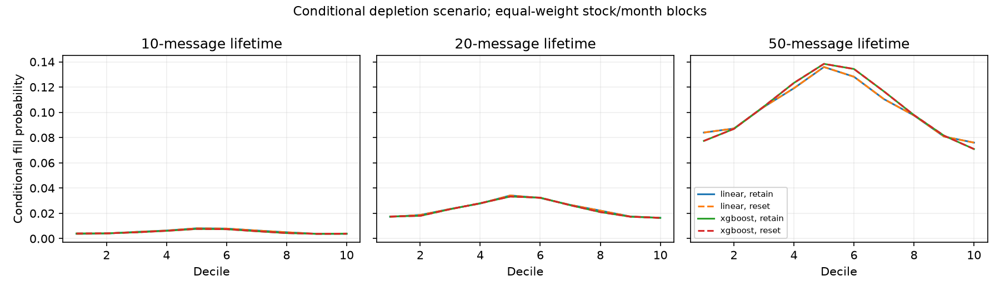
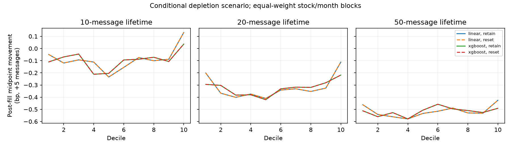
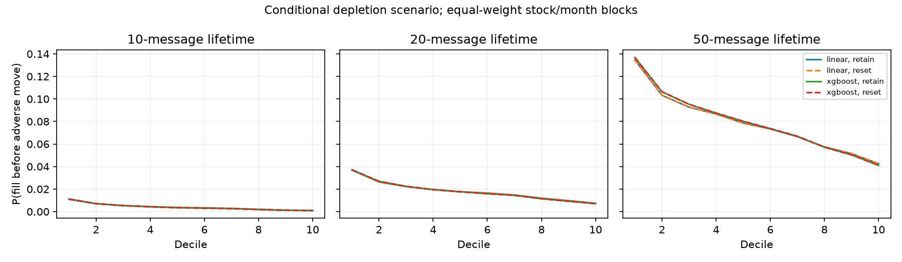
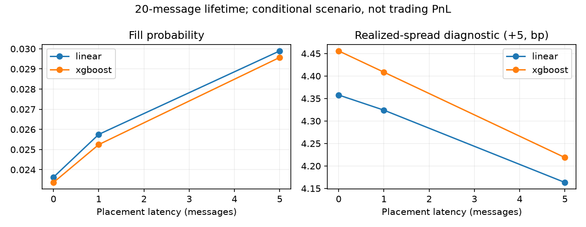

# Queue-aware passive execution report

The order feed does not uniquely identify historical executions. **Y is retransmission**, and D does not distinguish cancellation from complete execution. Consequently, this experiment reports conditional depletion diagnostics and a zero identified lower fill bound. It does not establish an executable strategy.

## Measured conclusion

The full run replayed 25,598,356 original test-window source messages per priority interpretation (51,196,712 including both interpretations), completed all 822 cells and reused every planned prediction task. All 83 tests passed, including published denominators, original prediction identities and aggregate recomputation; the public privacy check passed.

At zero latency, XGBoost conditional fill probabilities were 0.5232%, 2.3365% and 10.3166% for lifetimes 10, 20 and 50. Its five-message post-fill midpoint changes averaged -0.0975, -0.3335 and -0.5143 bp. The positive realized-spread diagnostics (4.5485, 4.4559 and 4.9552 bp) describe hypothetical passive entry prices under the scenario; they do not identify realized profit.

Relative to Linear, XGBoost's fill probability was lower at 10 and 20 messages, and higher at 50. At 20 messages the difference was -0.0261 percentage points, with only 4/20 block wins. The five-message post-fill markout difference was -0.0010 bp, with 9/20 wins. Its realized-spread diagnostic was 0.0981 bp higher, with 17/20 wins, but the two models select different directions and filled subsets. This does not isolate a causal execution advantage.

Stronger positive and negative signal tails had lower conditional fill probability than central prediction deciles. Larger initial queues had lower fill-before-adverse probability. For the 20-message XGBoost scenario, placement delay increased conditional fill probability while reducing the realized-spread diagnostic. These patterns illustrate the trade-off between forecasting price and obtaining passive fills, rather than a universal model winner.

June seed-7 shuffled controls had higher conditional fill probabilities than the same five June primary XGBoost blocks: 1.7384% vs 0.6587%, 5.2809% vs 2.7011%, and 16.3228% vs 11.1205%. Their realized-spread diagnostics also remained positive. Positive passive-price diagnostics therefore cannot by themselves establish predictive alpha. All additional control seeds remain in the public tables.

The two priority interpretations produced identical block fill probabilities in this sample. This does not resolve missing execution/cancellation labels, matching-phase ambiguity or hidden liquidity. The unconditional identified lower fill probability remains zero, and its conditional post-fill outcome remains undefined.

## Frozen method

Read [source semantics](WSELOB_QUEUE_SEMANTICS.md) and the [preregistered roadmap](QUEUE_AWARE_EXECUTION_ROADMAP.md). Reuse all 137 original prediction tasks: 120 primary tasks and 17 shuffled-label controls. Five stocks, four fixed months, 10/20/50-message lifetimes, and 0/1/5-message placement latencies remain unchanged. Two priority interpretations produce 822 evaluation cells.

Each virtual order is independent, has one dataset-native displayed quantity unit, and joins the back of the visible best bid for a positive prediction or best ask for a negative prediction. Exactly zero predictions remain eligible but place no order. No repricing occurs. The queue ahead is tracked by individual order identity and entry state; new arrivals behind the virtual order cannot add queue ahead.

The conditional scenario treats D removals and same-price M quantity reductions as executions. A fill requires consumption of at least one unit from an order behind the virtual order after its ahead queue has cleared. Deleting the final ahead order alone cannot fill the virtual order. This is an explicit scenario, not a proven upper bound over every hidden matching process. The two modification interpretations retain ambiguous priority or move ambiguously modified orders behind existing orders. They are sensitivity checks, not two identified matching engines.

The adverse threshold is the smallest positive adjacent visible-price difference observed so far that day, using no later prices. Midpoint movement of at least that amount against the chosen direction triggers the adverse event. Simultaneous fill/adverse messages are reported separately; they are never counted as fill-before-adverse. A virtual order ends at fill, lifetime expiry, invalid state or segment boundary; Y retransmissions additionally break the diagnostic path.

Post-fill side-adjusted midpoint changes use offsets 1, 5 and 10 messages. The remaining-original-horizon outcome uses decision event plus prediction horizon, and is undefined if the fill occurs later. The realized-spread diagnostic is twice the side-adjusted difference between future midpoint and passive fill price, divided by fill price, in basis points. These are historical diagnostics, not realized trading PnL. Fees, rebates, hidden liquidity, impact, matching-phase uncertainty, inventory and competing virtual orders are not modeled.

## Zero-latency results

| interpretation | model | horizon | fill_probability | mean_fill_time | markout_5 | spread_5 | fill_before_adverse |
| --- | --- | --- | --- | --- | --- | --- | --- |
| reset | linear | 10 | 0.005445 | 7.722464 | -0.097903 | 4.473961 | 0.004249 |
| retain | linear | 10 | 0.005445 | 7.722464 | -0.097903 | 4.473961 | 0.004249 |
| reset | linear | 20 | 0.023626 | 14.053638 | -0.332525 | 4.357799 | 0.018396 |
| retain | linear | 20 | 0.023626 | 14.053638 | -0.332525 | 4.357799 | 0.018396 |
| reset | linear | 50 | 0.102338 | 30.962096 | -0.520131 | 4.848749 | 0.079011 |
| retain | linear | 50 | 0.102338 | 30.962096 | -0.520131 | 4.848749 | 0.079011 |
| reset | xgboost | 10 | 0.005232 | 7.749577 | -0.097450 | 4.548502 | 0.004103 |
| retain | xgboost | 10 | 0.005232 | 7.749577 | -0.097450 | 4.548502 | 0.004103 |
| reset | xgboost | 20 | 0.023365 | 14.095897 | -0.333498 | 4.455874 | 0.018258 |
| retain | xgboost | 20 | 0.023365 | 14.095897 | -0.333498 | 4.455874 | 0.018258 |
| reset | xgboost | 50 | 0.103166 | 31.021042 | -0.514289 | 4.955204 | 0.079849 |
| retain | xgboost | 50 | 0.103166 | 31.021042 | -0.514289 | 4.955204 | 0.079849 |

All headline means weight stock/month blocks equally. Tables expose eligible decisions, placed orders, fills, observable post-fill outcomes and the number of defined blocks. An undefined block prevents a strict headline mean; it is never silently assigned zero. Prediction and queue deciles preserve tied values and report the actual contributing block count. The identified zero-fill lower bound has undefined conditional markouts.

## Paired comparison and controls

`paired_model_differences.csv` reports XGBoost minus Linear means, medians, wins, leave-one-stock/month means and 10,000-resample paired block intervals. Intervals are descriptive; overlapping rows do not supply independent statistical evidence. Exact model eligibility is shared before selecting direction. Shuffled predictions use the identical scenario and output definitions; see `control_summary.csv`. No new fitting or parameter search is performed.

## Figures

## Reproduction and provenance

Run `scripts/run_queue_execution.py` with the frozen config, original private raw files, frozen cache and original prediction receipt roots. `--symbol` and `--month` split independent work; `--aggregate-only` assembles all 20 completed stock/month checkpoints and rejects missing cells. Paths are runtime arguments and do not enter scientific identity. Run `scripts/render_queue_execution.py` on the public aggregates.

The manifest binds source code, scientific configuration, original cache and all prediction hashes. Its separate scientific experiment/task IDs depend on scientific settings, raw-source and prediction hashes and task coordinates; they exclude runtime paths, hardware and checkpoint placement. Public CSV hashes bind the published tables. Original prediction timestamps, indices and outcomes must match cached rows. Source-file and partition hashes must match. Queue-derived ten-level snapshots are compared with every retained cached event; independent order/aggregate queue parity is checked every 1,000 original messages. Previous benchmark artifacts remain unchanged.

Python remains the reference implementation. The subsequent C++20 engineering track completed full-domain byte parity and measured acceleration; see the [C++20 report](CXX20_REPLAY_QUEUE_REPORT.md). The scientific outputs and conditional queue assumptions in this report are unchanged.

## Attribution

Marszałek, Adam (2023), WSELOB-2017, Mendeley Data V1, DOI 10.17632/3g4mhdp899.1, [dataset](https://data.mendeley.com/datasets/3g4mhdp899/1), CC BY 4.0. Added queue reconstruction, conditional virtual-order diagnostics and aggregate figures. As-is; no warranty or endorsement.
