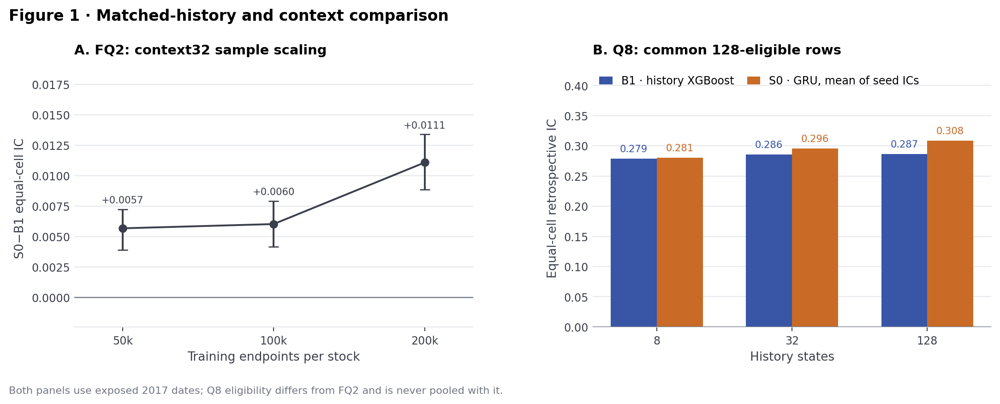
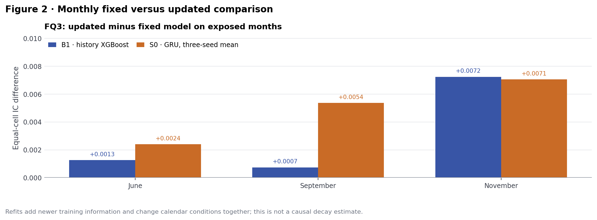
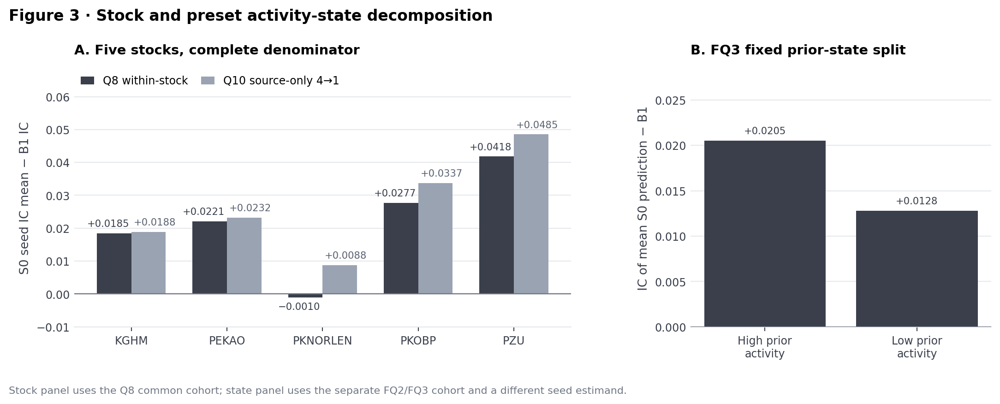
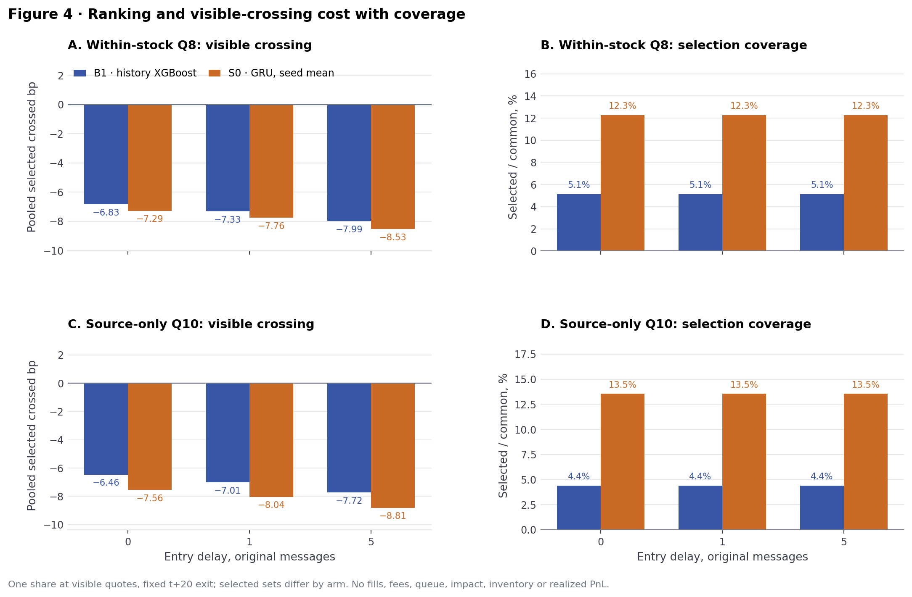

# Final WSELOB sequence-ML research package

> [!IMPORTANT]
> Status: **formal historical program complete; retrospective**. All evaluation dates and stocks were exposed to the research process, so these results are not independently confirmed. This completed package covers historical WSE research only; it does not establish current-market trading performance.

**Contents:** [Key terms](#key-terms) · [Research answer](#research-answer) · [Figures](#figures) · [Reproducibility and cost](#reproducibility-and-cost) · [Claim boundary](#claim-boundary)

## Key terms

| Term | Meaning |
| --- | --- |
| WSE / WSELOB | Warsaw Stock Exchange limit-order-book data, five equities, 2017. |
| B1 | History XGBoost: the cheap, history-matched baseline. |
| S0 | One-layer GRU, trained with seeds 7/17/29. |
| S1 | Small Transformer (FQ4 only). |
| IC | Spearman rank correlation between forecast and realized midpoint change. It is not a return. |
| h20 / t+20 | 20 original order-book messages ahead. |
| Equal-cell | Each stock/day cell is averaged once. |
| Dates | Jan–Mar trained models; April alone selected checkpoints/context; June, September and November supplied historical diagnostics. |

## Research answer

| Stage | What it tests | Result |
| --- | --- | --- |
| **FQ2** | Training size per stock | History-matched GRU improved retrospective h20 ranking versus history XGBoost as formal per-stock training grew from 50k to 200k endpoints. |
| **FQ4** | Transformer vs GRU | The frozen context32 Transformer underperformed GRU (paired S1−S0 IC −0.009788). This negative result was retained without rescue tuning. |
| **Q8** | History length, within-stock | 8/32/128-state sensitivity used one common context128-eligible endpoint cohort. April alone selected 128; historical S0−B1 IC was +0.021823. PKNORLEN's within-stock effect was −0.000997. |
| **Q10** | Train on four stocks, test the fifth | Five true four-source-stock → one-held-out-stock folds trained, normalized and selected context on source stocks alone. Historical S0−B1 IC was +0.026592 over 315 stock/day cells, conditional on already exposed stocks/dates. Source-April GRU context selection favors the neural arm. |
| **Q11** | Visible quote crossing cost | The unchanged strict >1 bp visible quote crossing with 0/1/5-message entry delays and fixed t+20 exit was negative for both finalists, in both within-stock and source-only predictions at all delays. At zero delay, equal stock/day crossed results were Q8 B1/S0 −7.019/−7.165 bp and Q10 B1/S0 −6.781/−7.354 bp. These are research quote diagnostics, not fills or PnL. |

The [five-minute brief](SEQUENCE_ML_FINAL_RESEARCH_BRIEF.md) states the design and interpretation. The prior 20k Q2/Q3/Q6 package remains an archived pilot, not final evidence.

**Detailed stage reports:** [FQ2](SEQUENCE_ML_FQ2_REPORT.md) · [FQ3](SEQUENCE_ML_FQ3_REPORT.md) · [FQ4](SEQUENCE_ML_FQ4_REPORT.md) · [Q8](SEQUENCE_ML_Q8_REPORT.md) · [Q10](SEQUENCE_ML_Q10_REPORT.md) · [Q11](SEQUENCE_ML_Q11_REPORT.md)

## Figures

`results/sequence_ml_final_v1/figures/` contains four final figures. Blue is B1 (history XGBoost) and orange is S0 (GRU) wherever the two models appear side by side, matching the README headline figure. Slate gray marks S0−B1 differences.

### Figure 1 · Matched-history and context comparison



*A: FQ2 sample scaling at context32 (S0−B1 IC with 95% five-day block intervals). B: Q8 B1 and S0 IC on the common 128-eligible rows, by history length. The two panels use different cohorts and are never pooled.*

### Figure 2 · Monthly fixed versus updated comparison



*FQ3: IC of the updated (refit) model minus the fixed model, per exposed month.*

### Figure 3 · Stock and preset activity-state decomposition



*A: S0−B1 IC for all five stocks, Q8 within-stock versus Q10 source-only. B: FQ3 fixed prior-state split (high versus low prior activity), measured as IC of the mean S0 prediction minus B1.*

### Figure 4 · Ranking and visible-crossing cost with coverage



*Q11 visible crossing (left) and the share of common opportunities each arm selected (right). Bars are pooled over selected opportunities; the Research answer quotes equal stock/day means, so the two can differ.*

## Reproducibility and cost

The four figures cover matched-history/context comparison; monthly fixed-versus-updated comparison; complete stock and preset activity-state decomposition; and ranking/visible-crossing cost plus coverage. `cost_table.csv` records 7.912 allocated GPU-hours across FQ2/FQ3/FQ4/Q8/Q10 and 1.264 allocated CPU core-hours for Q11, with the small FQ3 CPU diagnostic wall allocation separately identified. Allocation is not utilization.

From the scientific task branch and public aggregate receipts:

```bash
# Rerun all six formal aggregators; requires byte-for-byte equality.
python3 scripts/recompute_sequence_ml_final.py --out /tmp/wse-recompute.json

# Regenerate the brief, four figures and cost table.
python3 scripts/render_sequence_ml_final_brief.py --out /tmp/wse-brief.md
python3 scripts/render_sequence_ml_final.py --out /tmp/wse-package

# Independently verify receipt/parent/source/model hashes and write a fresh manifest.
python3 scripts/verify_sequence_ml_final.py --manifest-out /tmp/wse-scientific-manifest.json
```

| Receipt | Contents |
| --- | --- |
| [`recomputation.json`](../results/sequence_ml_final_v1/recomputation.json) | Six byte-identical aggregate reruns. |
| [`scientific_manifest.json`](../results/sequence_ml_final_v1/scientific_manifest.json) | 65 run receipts, 215 model hashes, source/partition hashes and all output hashes. |
| [`render_manifest.json`](../results/sequence_ml_final_v1/render_manifest.json) | Input aggregate, figure and cost-table hashes. |
| [`cost_table.csv`](../results/sequence_ml_final_v1/cost_table.csv) | Allocated GPU and CPU hours per stage. |

Original licensed WSE rows, row predictions, model weights and scheduler logs remain private.

## Claim boundary

All June/September/November observations and all five stocks were previously exposed to the research process. Date-block intervals condition on fitted models and historical dates. The Q5 source/access audit qualified zero genuinely new WSE original-event h20 final days. The supported claim is a reproducible **retrospective research method and result**, including the failed Transformer and negative visible execution. Independent generalization or profitable execution requires new qualified data and a separately frozen confirmation protocol.
