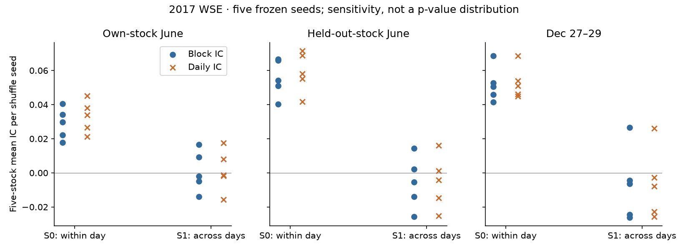
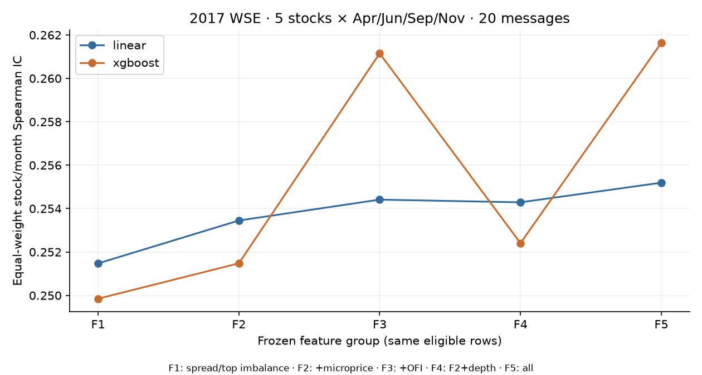
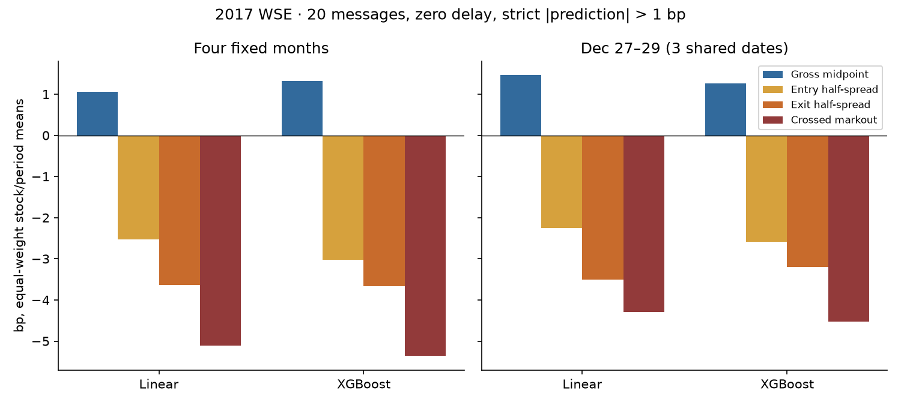
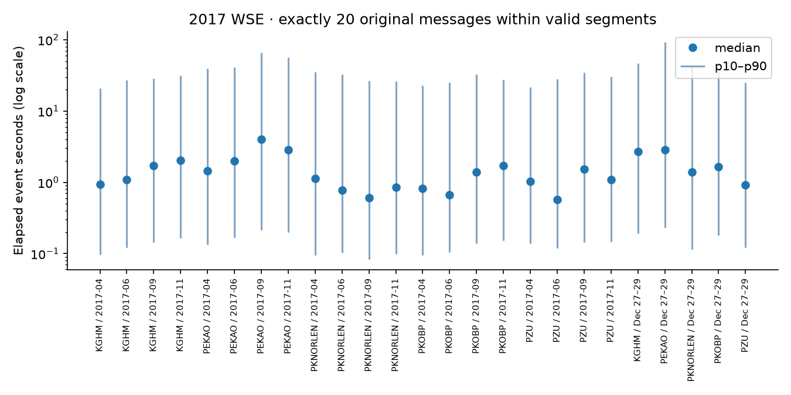
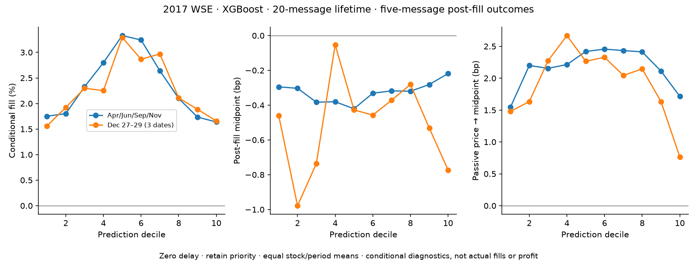

# Signal and execution diagnostics: WSELOB research audit v1

This audit explains the existing five-stock **2017 Warsaw Stock Exchange** results through fixed controls, matched feature comparisons, visible-cost accounting and exact event timing. It does not introduce a new market or an uninspected holdout. The original [three-day preregistered confirmation](LATER_PARTITIONS_CONFIRMATION_REPORT.md) remains a separate historical experiment.

The [audit protocol](RESEARCH_AUDIT_PROTOCOL.md) and [configuration](../configs/wselob_research_audit_v1.json) were saved before the new fits. All underlying test periods had already been inspected. No model family, hyperparameter, threshold, seed or test period was selected in response to these audit outcomes. Undefined metrics remain undefined; strict headline means require their full declared denominator.

## Evidence inventory and historical results

| Existing evidence | Verified scope and value | Treatment in this audit |
|---|---|---|
| Engineering preparation | 85,846,918 messages; 56,887,949 feature rows; five stocks, 1,250 stock/day partitions | Reuse source/cache hashes; check feature identity on all partitions |
| Original monthly prediction | h20 Linear 0.255193; XGBoost 0.261639; equal-weight 20 stock/month ICs | Reuse 40 original full-feature prediction receipts on exactly matched rows |
| Original transfer | Primary mean IC 0.262463 over 20 blocks; June seed-7 control 0.066518 over five stocks | Reuse primary aggregates; regenerate the fixed June control because original transfer row predictions were not retained, and report numerical drift |
| Original own-stock June control | Seed-7 mean IC 0.034216 over five stocks | Reuse five seed-7 and two existing PEKAO extra-seed prediction receipts where exact matches exist |
| Later confirmation | h20 Linear 0.261720; XGBoost 0.274159; five positive paired differences; control 0.041452 | Reuse archived primary and five original seed-7 control receipts |
| Visible crossing | Original h20 XGBoost −5.363776 bp; later −4.519463 bp | Reconstruct all 516 existing cells; preserve historical values |
| Passive queue | 822 monthly + 210 later conditional cells | Reuse existing outputs and clarify denominators and the factor-of-two spread diagnostic |
| Native kernels | 604,837,896 virtual evaluations; 8.984× replay / 3.571× queue fixed-workload ratios | Reuse unchanged-core receipts; rebuild and test both current software paths |

The original monthly sample is April, June, September and November. The later sample comprises December 27–29 with one fit through December 22 per stock/model/horizon, not another monthly expanding-window fold. Three shared dates are not 15 independent time periods. Prior non-exposure partly rests on operator attestation, as documented in the [exposure audit](LATER_PARTITIONS_UNTOUCHED_AUDIT.md). The [original preregistration](LATER_PARTITIONS_CONFIRMATION_PROTOCOL.md) is unchanged.

## A. Why are shuffled-label correlations nonzero?

### Implementation audit

The label-copy/permutation tests pass. They verify nontrivial positional indices, group label multisets, unchanged input and test labels, identical-seed reproducibility and different-seed permutations. Transfer excludes the target stock and uses strictly earlier dates. Linear standardization uses training statistics. Constant predictions return undefined Spearman IC. Full-feature row eligibility, exact prediction event/time identities, content hashes and label agreement prevent accidental comparisons of different scoring rows.

Source tracing checks after-message causal features, lag-only OFI, feature resets at invalid segments, same-day/segment future labels and chronologically sorted source construction. No specified implementation error was identified. These checks do not prove that every possible leakage mechanism is absent, nor do they alone explain residual statistical association. The original transfer control is newly fit here and compared numerically with its archived score rather than advertised as byte-identical predictions.

S0 permutes training labels within each stock/date, preserving each date's entire label distribution. S1 permutes within each stock across its training history. It destroys that date-specific preservation while retaining the stock-level distribution. The model seed remains 7; only label permutations use seeds 7, 17, 29, 43 and 71. Both methods leave the same test labels and rows untouched.

### Complete control results

All **150/150** cells completed: **138 new fits and 12 verified archived predictions**. Each scope/method below averages five stocks and five fixed shuffle seeds. The seed range refers to five separate five-stock means, not 25 independent replications. Each block IC pools its declared test period; daily IC first scores each date, then weights dates equally within that stock/period.

| Scope | Shuffle | Block IC | Equal-weight daily IC | Range of five-stock seed means |
|---|---|---:|---:|---:|
| Own-stock June | S0 within stock/day | 0.028815 | 0.033007 | 0.017681 to 0.040386 |
| Own-stock June | S1 across stock history | 0.000930 | 0.001376 | −0.013996 to 0.016589 |
| Leave-one-stock-out June | S0 | 0.055532 | 0.059029 | 0.040153 to 0.066518 |
| Leave-one-stock-out June | S1 | −0.005674 | −0.005371 | −0.025653 to 0.014390 |
| Later three dates | S0 | 0.051834 | 0.052929 | 0.041452 to 0.068525 |
| Later three dates | S1 | −0.006971 | −0.006661 | −0.026155 to 0.026526 |

Primary, unshuffled XGBoost references are approximately **0.268427** for own-stock June, **0.268450** for transfer June and **0.274159** for the later period. The original transfer-wide 0.262463 is a four-month mean and must not be substituted for the June reference. [control_main_reference.csv](../results/wselob_research_audit_v1/control_main_reference.csv) retains the five individual primary values per scope.

S0 remains positive across every five-stock seed mean, whereas all three S1 ranges straddle zero. S1 means are close to zero, but individual cells are not: for example, own-stock PKNORLEN still has a five-seed S1 mean of **0.027149**. Later S0 is heterogeneous: PKNORLEN's five-seed mean is **0.152624**, versus **0.004701** for PEKAO. Neither the seed-7 headlines nor the grand averages describe every stock.

Daily IC is similar to, and usually slightly above, block IC for S0. Thus this is **not explained merely by pooling days with different label means**. The descriptive mean correlation between daily prediction means and daily label means is 0.0808 / 0.1377 / 0.3400 for S0 own/transfer/later, versus −0.0005 / −0.0576 / 0.1800 for S1. The later statistic uses only three dates per cell and is especially unstable. These daily-mean correlations cannot be converted into a fraction of total IC, and no test-day label mean is used as a predictor.

The full 2,250 control stock/day rows retain IC, mean and standard deviation of predictions and labels, row counts and undefined reasons. [control_blocks.csv](../results/wselob_research_audit_v1/control_blocks.csv), [control_daily.csv](../results/wselob_research_audit_v1/control_daily.csv), [five-seed stock summaries](../results/wselob_research_audit_v1/control_stock_seed_distribution.csv), [cohort summaries](../results/wselob_research_audit_v1/control_cohort_summary.csv) and [daily-mean diagnostics](../results/wselob_research_audit_v1/control_daily_mean_diagnostics.csv) preserve the complete matrix.



| Candidate explanation | Evidence supporting it | Evidence against an overly strong version / remaining uncertainty |
|---|---|---|
| Date-conditioned training structure survives S0 | S0 preserves each training date's label multiset; switching to S1 greatly reduces mean control IC in every scope | The intervention changes a distributional constraint, not one uniquely identified mechanism. It does not isolate which feature/date mixtures carry the association. |
| Pure between-test-day mean effect | Daily prediction/label means have some positive descriptive association | S0 daily IC remains positive and close to block IC. A story based only on pooled day means is insufficient. |
| Finite permutation/sample variation | S1 seed means vary on both sides of zero; individual stock residuals remain | All five S0 seed means stay positive in all scopes, so “one unlucky seed” does not adequately describe S0. Five seeds cannot support precise tail probabilities. |
| Implementation or identity error | Such errors can produce nonzero controls, so they were explicitly checked | Specified shuffle, chronology, stock exclusion, scaling and identity tests pass. No error requiring a scientific correction was found; passing tests is not a universal no-leakage theorem. |
| Very small prediction amplitude should imply zero IC | Control score standard deviations range from about 0.007 to 0.031 bp across cells | Spearman depends on ranks; nonconstant tiny predictions can retain correlation. Small amplitude alone cannot explain away the statistic. |

**Implementation audit: passed within the checked contract. Statistical explanation: partially supported, not uniquely identified.** The evidence favors date-preserved training structure plus finite variation over either a purely pooled-day artifact or a single bad permutation. It does not justify labeling controls “zero,” calculating a five-seed p-value, or claiming all possible leakage has been excluded. The primary prediction evidence remains substantially larger, but that fact alone is not the explanation.

## B. Where does the predictive information come from?

### Microprice is a representation of an interaction

Let A and B be the best ask and bid prices, and b and a their respective bid and ask displayed sizes. Microprice is `(A b + B a)/(b+a)`. Subtracting midpoint `(A+B)/2` gives `(A−B)(b−a)/(2(b+a))`. Therefore, in midpoint-normalized basis points:

`microprice_minus_mid_bps = 0.5 × spread_bps × top_imbalance`.

Across all **1,250** feature partitions, 56,887,949 total rows and **56,866,713** finite full-feature rows, the maximum absolute discrepancy is **4.21e−12 bp**. [feature_algebra.csv](../results/wselob_research_audit_v1/feature_algebra.csv) reports counts and errors by stock/day. Zero-depth and extreme-imbalance boundary tests pass. This is algebraic equivalence within floating precision, not byte equivalence or a guarantee of identical trained trees. Adding microprice lets a linear model express a spread-by-imbalance interaction; it does not add an independent raw measurement.

### All matched feature comparisons

All **200/200** cells completed: **160 new fits and 40 verified original F5 predictions**. Every comparison uses the same finite full-five-feature rows, target, training dates and frozen parameters. This prevents dropping a feature from changing the sample. The table uses equal-weight **20 stock/month** ICs; the 4,050 stock/day scores are also published separately.

| Features | Linear block IC | XGBoost block IC | Linear daily IC | XGBoost daily IC |
|---|---:|---:|---:|---:|
| F1: spread + top imbalance | 0.251475 | 0.249847 | 0.255227 | 0.253538 |
| F2: F1 + microprice | 0.253451 | 0.251478 | 0.257820 | 0.255461 |
| F3: F2 + normalized L1 OFI | 0.254414 | 0.261152 | 0.258781 | 0.264430 |
| F4: F2 + ten-level depth imbalance | 0.254290 | 0.252407 | 0.258408 | 0.256260 |
| F5: original full five features | 0.255193 | 0.261639 | 0.259315 | 0.264877 |

The simplest two-feature Linear model is already close to full Linear: 0.251475 versus 0.255193. Adding the explicit spread interaction gives a small further increment. **OFI provides the largest conditional XGBoost increment** in this fixed comparison; depth contributes less and less consistently. This is not an additive “percentage of signal explained” decomposition: IC is a rank statistic, feature interactions matter, and fitted algorithms depend on representation.

| Model | Paired addition | Mean ΔIC | Median ΔIC | Positive blocks / 20 |
|---|---|---:|---:|---:|
| Linear | F2−F1: microprice | 0.001976 | 0.002214 | 19 |
| Linear | F3−F2: OFI | 0.000963 | 0.000792 | 17 |
| Linear | F4−F2: depth | 0.000839 | 0.000518 | 14 |
| Linear | F5−F3: depth with OFI | 0.000779 | 0.000513 | 14 |
| Linear | F5−F4: OFI with depth | 0.000903 | 0.000775 | 17 |
| XGBoost | F2−F1: microprice | 0.001631 | 0.001483 | 15 |
| XGBoost | F3−F2: OFI | 0.009674 | 0.009483 | 20 |
| XGBoost | F4−F2: depth | 0.000929 | 0.000728 | 14 |
| XGBoost | F5−F3: depth with OFI | 0.000487 | 0.000416 | 13 |
| XGBoost | F5−F4: OFI with depth | 0.009232 | 0.009280 | 20 |

| XGBoost minus Linear | Mean ΔIC | Median ΔIC | Positive blocks / 20 |
|---|---:|---:|---:|
| F1 | −0.001627 | −0.001492 | 3 |
| F2 | −0.001972 | −0.001240 | 3 |
| F3 | 0.006739 | 0.007005 | 19 |
| F4 | −0.001882 | −0.001571 | 5 |
| F5 | 0.006446 | 0.007171 | 18 |

XGBoost does **not** win merely because it is more complex: it loses the mean comparison in F1, F2 and F4. Its advantage appears in the OFI-containing groups. At F5, mean gains are positive for every stock (0.002750–0.010500) and every month (0.003205–0.008969), yet two individual blocks are negative. The magnitude is modest, and no formal significance or universal-model claim follows. Fixed column subsampling and feature order mean that these are increments for the specified fitted algorithms, not pure information or causal contributions. The earlier PEKAO ablation and tree-gain rankings remain historical starting points, not new discoveries.

All **300 paired differences** (15 contrasts × 20 blocks) appear in [ablation_paired.csv](../results/wselob_research_audit_v1/ablation_paired.csv), with [strict summaries](../results/wselob_research_audit_v1/ablation_summary.csv), [block scores](../results/wselob_research_audit_v1/ablation_blocks.csv) and [daily scores](../results/wselob_research_audit_v1/ablation_daily.csv).



### Training-defined state comparisons

Training spread and top-imbalance tertiles define nine states per block, with ties assigned to the lower bin. The saved boundaries never use test labels. All **1,800** model/feature/block/state cells are retained; this run has no empty or undefined state IC, while the implementation tests explicitly cover empty tied bins. The full [state table](../results/wselob_research_audit_v1/state_diagnostics.csv) contains row counts and exact training boundaries; [state contrasts](../results/wselob_research_audit_v1/state_paired_summary.csv) contain every predeclared contrast.

For F5, mean XGBoost-minus-Linear IC within each state is:

| Training spread bin | Low imbalance | Middle imbalance | High imbalance |
|---|---:|---:|---:|
| Low | 0.028375 (19/20 positive) | 0.038006 (20/20) | 0.029005 (19/20) |
| Middle | 0.022783 (19/20) | 0.018606 (20/20) | 0.019272 (19/20) |
| High | 0.007826 (15/20) | 0.008237 (15/20) | 0.007021 (13/20) |

The within-state advantage is larger in the lower-spread bins and is not confined to one isolated positive state. These correlations re-rank observations within restricted populations; their weighted average need not equal the whole-block ΔIC. Larger conditional differences do not quantify how much of the global advantage comes from each bin, and no bin is promoted to a validated strategy.

**Plain-language interpretation:** the balance of displayed buying and selling interest near the best quotes already predicts much of the short-term direction. Telling Linear how that imbalance combines with the spread helps a little. Recent changes in the best-quote queues help the tree model more than simply adding deeper resting volume. The extra predictive improvement is small and consistently observed in these fixed descriptive comparisons; it does not pay the visible crossing costs below.


## Prediction, visible cost and the event clock

### Exact row accounting

All **516/516** original aggressive cells were reconstructed: 411 from the original monthly experiment and 105 from the three-day confirmation. The new crossed markout, threshold-selected count and common eligible count match the corresponding published values exactly. The maximum row-level floating residual in the cost identity is **2.23e−12 bp** (rounded upward). No earlier result was overwritten or corrected.

For side `s` (+1 long, −1 short), entry `e=t+d`, exit `x=t+d+h`, midpoint M and full spread W:

`crossed = 10^4 s(M_x−M_e)/M_e − 10^4 W_e/(2M_e) − 10^4 W_x/(2M_e)`.

Entry midpoint is the denominator for **all three terms**, including exit spread. Each table first intersects eligible rows across delays, then applies the existing strict `abs(prediction)>1 bp` rule. Means weight stock/month blocks (20) or later stock-period blocks (5) equally, not selected rows pooled across stocks.

| Period | Model | Gross midpoint, bp | Entry half-spread, bp | Exit half-spread, bp | Crossed, bp |
|---|---|---:|---:|---:|---:|
| Original four months | Linear | 1.0525 | 2.5248 | 3.6408 | −5.1131 |
| Original four months | XGBoost | 1.3212 | 3.0198 | 3.6652 | −5.3638 |
| Later three dates | Linear | 1.4671 | 2.2555 | 3.5050 | −4.2934 |
| Later three dates | XGBoost | 1.2597 | 2.5799 | 3.1992 | −4.5195 |

Primary: 20 messages, zero placement delay. The positive selected midpoint movement is substantially smaller than the combined visible spread deductions. This explains the negative diagnostic directly, without inventing a fee rate. The break-even shortfall column is simply the negative of the visible-quote markout; fees, impact and inventory remain unmodeled.

The old [prediction-bin curves](../results/wselob_execution_robustness_v1/block_prediction_deciles.csv) and later [curves](../results/wselob_later_confirmation_v1/aggressive_deciles.csv) describe the same frozen predictions. The decomposition shows why midpoint ranking alone does not pay for crossing. Linear and XGBoost have different threshold-selected orders; a difference in their means is not an effect of swapping models on an identical order sample. The result rejects these fixed historical crossing rules within the declared sample, not all trading or execution choices.



### Two different latency questions

The original rule moves both entry and exit, `t+d` and `t+d+h`. It therefore includes a shifted holding window and cannot isolate pure hardware latency. The supplemental **186-cell** fixed-exit diagnostic instead enters at `t+d` and exits at `t+20`, so holding time shrinks with d. Both use d=0/1/5 and a common eligible intersection within their own rule.

| Period | Model | Fixed-exit d=0, bp | d=1, bp | d=5, bp |
|---|---|---:|---:|---:|
| Original four months | Linear | −5.1131 | −5.7826 | −6.2976 |
| Original four months | XGBoost | −5.3628 | −5.8313 | −6.4352 |
| Later three dates | Linear | −4.2932 | −6.1890 | −6.5457 |
| Later three dates | XGBoost | −4.5211 | −4.9439 | −5.4987 |

All primary headlines remain negative. Even d=0 can differ slightly from the original table: fixed-exit eligibility requires a path through t+20, whereas the original common-delay sample requires t+25. Thus the two tables are separately defined diagnostics, not a perfectly paired causal contrast. Counts and coverage are retained in [fixed_exit_latency.csv](../results/wselob_research_audit_v1/fixed_exit_latency.csv).

### How long are twenty messages?

Source `time`, not `priority_date`, is matched to every cached event timestamp and original event index. Its storage unit is nanoseconds since epoch; the observed minimum positive increment and greatest common divisor of positive increments are **1,000 ns (one microsecond)** in all 420 checked source days. Source times are nondecreasing and agree with the daily key after conversion to Europe/Warsaw. Across full source-day adjacent messages, **3.51%** share a timestamp. This measures observed timestamp resolution, not an independent guarantee of exchange clock accuracy.

Timing distributions start at valid visible-book rows and pair exact source offsets only within the same stock/day/segment. They are not distances between filtered model rows. End-of-segment pairs remain in invalid counts. The clock population includes valid book rows whose lag-dependent features may be undefined; it is explicitly distinct from the finite-feature prediction population.

For the original 20 stock/month blocks, the **20-message median ranges from 0.575 to 4.001 seconds**; p90 ranges from **20.61 to 65.55 seconds**. For the five later stock-period blocks, medians range from **0.926 to 2.863 seconds**, and p90 from **25.19 to 92.90 seconds**. No valid 20-message pair has zero elapsed time in this sample. Individual-day dispersion and p99 are retained; a pooled “typical millisecond latency” would hide substantial stock/date variation.

All five requested offsets (1/5-message latency and 10/20/50-message horizons) are in [event_time_summary.csv](../results/wselob_research_audit_v1/event_time_summary.csv): 2,100 stock/day/offset rows plus 125 stock/period/offset rows, with p10/p50/p90/p99, zero counts and valid/invalid denominators. [event_clock_precision.csv](../results/wselob_research_audit_v1/event_clock_precision.csv) separately audits the raw clock.

**Interpretation:** in these 2017 stocks, a twenty-message forecast commonly spans fractions of a second to several seconds, with much slower tails. It is not automatically a twenty-millisecond opportunity. Historical event time does not establish achievable order transmission, queue priority or fill latency.



## Conditional passive accounting

All **1,032** published stock/period queue cells are preserved: 822 monthly and 210 later-period cells, including controls and both priority interpretations. [passive_accounting.csv](../results/wselob_research_audit_v1/passive_accounting.csv) retains eligible decisions, placed orders, fills, waiting time, each observable post-fill denominator, original midpoint and spread diagnostics, and the corresponding passive-price markout. No queue path is refit or reinterpreted.

For signed direction s, passive entry price P, midpoint at conditional fill M_f and observable future midpoint M_u:

- post-fill midpoint markout: `10^4 s(M_u−M_f)/M_f`;
- passive-price-to-midpoint markout: `10^4 s(M_u−P)/P`;
- existing spread diagnostic: **twice** the passive-price-to-midpoint markout.

The two markouts have different reference prices and denominators. A buy at the bid can be followed by an unfavorable midpoint decline while the future midpoint still exceeds the bid paid. Negative post-fill midpoint movement and positive passive-price diagnostics are therefore compatible. Halving the old spread diagnostic makes the one-way passive-price interpretation explicit; it does not turn it into realized profit.

At 20-message lifetime and zero delay, XGBoost's old equal-weight fill probability is 2.3365%, average wait 14.0959 messages, post-fill five-message midpoint markout −0.3335 bp, and passive-price markout 2.2279 bp. The later equivalents are 2.2815%, 14.1615 messages, −0.4560 bp and 2.0554 bp. Both priority interpretations are retained even when their aggregate values coincide. These filled samples differ between models and from the aggressive threshold-selected samples.

For a matched control comparison, use June only for the old sample and all three dates for the later sample (XGBoost, h20, d0, retain). Each metric below is an equal-weight mean over five stocks; counts are summed and are not the denominator of those means.

| Cohort / group | Placed | Conditional fills | Observable five-message fills | Mean fill probability | Mean wait, messages | Post-fill midpoint, bp | Passive-price markout, bp |
|---|---:|---:|---:|---:|---:|---:|---:|
| June primary | 4,561,840 | 119,606 | 119,584 | 2.7011% | 13.8124 | −0.2487 | 2.6579 |
| June seed-7 control | 4,561,840 | 232,983 | 232,942 | 5.2809% | 12.9878 | −0.2305 | 2.4184 |
| Later primary | 483,307 | 9,927 | 9,927 | 2.2815% | 14.1615 | −0.4560 | 2.0554 |
| Later seed-7 control | 483,307 | 19,361 | 19,361 | 4.3007% | 13.4350 | −0.4214 | 1.6754 |

Controls fill more often and also have positive passive-price diagnostics, so positivity of that quantity is not a sufficient alpha test. [passive_matched_controls.csv](../results/wselob_research_audit_v1/passive_matched_controls.csv) retains both priority interpretations and the matched denominator. Compare these June controls with June primary, not the four-month primary mean.



Three evidentiary levels remain separate:

1. **Observed:** recorded order updates, visible prices, sizes and subsequent midpoints, subject to source/reconstruction boundaries.
2. **Conditional:** fills and post-fill selection under the explicit interpretation of D removals and same-price M reductions as executions, with one unit behind the existing queue. Clearing queue ahead alone is not a fill.
3. **Unidentified:** actual counterfactual fills, hidden liquidity, queue acceptance/priority, complete costs, portfolio constraints and realized trading profit.

Stronger tails have lower conditional fill probabilities, and average post-fill midpoint movement is adverse. The stronger-tail/worse-post-fill ordering did not consistently replicate across stocks in the later period. Do not replace that qualified result with a monotonic adverse-selection story. Positive passive-price diagnostics leave a research question about action selection; they do not establish an implementable profitable passive strategy.

## Software and reproduction boundaries

The initial suite had 162 passes and two environment failures because the installed XGBoost lacked an OpenMP runtime in its search path. Reusing an existing compatible runtime resolved those failures without changing scientific code: the modification-before baseline then passed **164 tests**. For the completed audit implementation at `55c346f`, the full suite passed **185 tests**. A fresh C++20 build and explicit native test run passed **68 tests**. With the extension actually disabled, the full fallback suite passed **123 tests**, with **62 native-only tests skipped**. Two existing warnings concern a pandas deprecation and physical-core detection.

The new tests cover label-only group permutations with nontrivial DataFrame indices, deterministic/different seeds, held-out-stock chronology, training-only scaling, constant-score undefined IC, full-feature sample intersection, empty tied state bins, strict NaN denominators, scientific versus runtime identity, exact event-time precision and gaps, both sides of the cost identity, delay/exit rules and strict threshold boundaries. An incomplete aggregate raises instead of silently publishing a reduced denominator.

The replay and queue kernels are unchanged from the original verified implementation, commit `3a62939ba8c3e2329605620eba500c90a37bd66f`. Consequently the existing 85,846,918-message / 604,837,896-virtual-order byte-parity receipt and 8.984× / 3.571× fixed-workload kernel speed ratios are **reused original engineering evidence**, not benchmarks rerun by this audit. Byte parity does not identify true exchange fills, and kernel speed is not end-to-end or live latency.


The real interruption exercise stopped an active new runner with **10 completed tasks and two incomplete task directories**. After resume, every completed metrics/prediction artifact retained its original hash and both incomplete tasks obtained valid completion receipts. Consolidation produced **350 distinct completed scientific task IDs**, with the full 150-control/200-ablation coordinate matrix and no duplicate or omitted task. The final matrix contains **298 newly fitted cells and 52 verified original-prediction cells**. Interrupted attempts are operational retries, not additional scientific results.

Model aggregation was executed twice from the completed hashed receipts with identical output hashes. Diagnostic aggregate-only reconstruction reproduced all numerical values exactly. Its first checkpoint reload sorted JSON keys, changing column order in four CSVs but no values; subsequent reconstructions were byte-identical. This serialization distinction is recorded rather than presented as a numerical discrepancy. All **72 captured original result artifacts** and the original later configuration/protocol hashes remain unchanged.

The complete aggregate check verifies 2,250 control-day rows, 4,050 ablation-day rows, 1,800 state rows, 300 paired feature differences, matched training/test row hashes, 516 cost cells, 186 fixed-exit cells, 1,032 passive cells and 2,225 clock rows. F5 scores match the archived 40 model/block scores; [baseline_reuse_check.csv](../results/wselob_research_audit_v1/baseline_reuse_check.csv) and [transfer_seed7_drift.csv](../results/wselob_research_audit_v1/transfer_seed7_drift.csv) separately record original reuse and fresh transfer-score drift. All five regenerated transfer seed-7 ICs match their archived scores at the published precision (maximum recorded drift 0.0); all 40 reused F5 scores also have recorded drift 0.0. Equal aggregate scores do not prove that newly generated row predictions are byte-identical.

The [verification summary](../results/wselob_research_audit_v1/verification.json), [software validation record](../results/wselob_research_audit_v1/software_validation.json) and [publication manifest](../results/wselob_research_audit_v1/manifest.json) bind the public evidence. All new tables and five plots are generated from saved aggregate inputs, not manually drawn result values. Scientific checks do not reinterpret conditional fills as exchange truth.


## Reproduce from the licensed inputs

For the completed v1 receipt aggregation, use the archived implementation at `55c346fe1559db52a5f15c3bf9b74ffe7d851a73`. The commands below record its historical execution, not instructions to rerun the completed audit. The corrected runner has a new implementation hash and requires an attested `--numerical-profile` for any future run/resume. See the [numerical compatibility contract](RESEARCH_AUDIT_PROTOCOL.md#numerical-backend-and-evidence-compatibility--correction-after-v1).

Install the project and optional dependencies as described in [reproducibility](REPRODUCIBILITY.md). Prepare the original licensed feature caches and retain the original private prediction receipts. Environment variables below identify caller-owned data and output directories, not published inputs. The complete fixed model plan contains 350 cells; runtime sharding does not change scientific task identity.

```bash
python -m cloblab.research_audit plan --history "$HISTORY_CACHE" \
  --tail "$LATER_CACHE" --work "$AUDIT_WORK"
python -m cloblab.research_audit run --history "$HISTORY_CACHE" \
  --tail "$LATER_CACHE" --work "$AUDIT_WORK" --device cuda:0 --threads 4 \
  --scopes own_june transfer_june monthly --prediction-roots "$ORIGINAL_GPU" "$ORIGINAL_CPU_H20"
python -m cloblab.research_audit run --history "$HISTORY_CACHE" \
  --tail "$LATER_CACHE" --work "$AUDIT_WORK" --device cpu --threads 4 \
  --scopes later --prediction-roots "$ORIGINAL_LATER"
# After interruption, repeat the same run arguments with command `resume`.
python -m cloblab.research_audit aggregate --history "$HISTORY_CACHE" \
  --tail "$LATER_CACHE" --work "$AUDIT_WORK"
python -m cloblab.research_diagnostics --history "$HISTORY_CACHE" \
  --tail "$LATER_CACHE" --raw "$RAW_DATA" --later "$ORIGINAL_LATER" \
  --work "$DIAGNOSTIC_WORK" --prediction-roots "$ORIGINAL_GPU" \
  "$ORIGINAL_CPU_H10" "$ORIGINAL_CPU_H20" "$ORIGINAL_CPU_H50"
# Add --aggregate-only to that diagnostic command to rebuild without replay.
python scripts/audit_event_clock.py --raw "$RAW_DATA"
python scripts/render_research_audit.py
python scripts/verify_research_audit.py \
  --old-hashes results/wselob_research_audit_v1/old_result_hashes.json
```

The final compatibility correction passed one targeted receipt-contract test (no fitting or market-data access); the original full-suite counts above describe the completed audit, not a rerun after this correction.

The public aggregate CSVs suffice for `render_research_audit.py`; private data are needed for fitting and row-level accounting. Devices can change numerical output without changing the scientific experiment: record fresh predictions and drift, never relabel them as archived predictions. The completed v1 receipts record runtime settings but did not enforce backend compatibility on resume. Task IDs bind scientific configuration, source implementation and every input feature-partition hash; they do not establish numerical equivalence. The completed predictions remain artifact-bound historical evidence, not a CPU/CUDA parity claim. The correction adds fail-closed profile matching for subsequent receipts without changing the 350 completed cells. Full private numerical-environment attestation remains the operator's responsibility; matching profiles alone do not prove identical new predictions. The v1 runner implements the fixed protocol; changing its scientific constants requires a new configuration/implementation identity and affected tasks, not reusing old receipt directories.

## Remaining scientific boundary and next question

The evidence supports historical midpoint prediction and rejects the fixed spread-crossing rules tested here. It neither rules out every execution method nor establishes a profitable passive strategy. Millions of overlapping rows, 20 stock/month blocks, five permutation seeds and three later dates are different denominators; none substitutes for independent time periods. State-bin comparisons and this entire audit are descriptive, after outcome inspection. They cannot validate a newly selected strategy.

The next useful question is whether a simple rule can choose **cross, join or abstain** on a longer genuinely uninspected period with clearer execution/cancellation fields. Freeze a common decision time, one-unit exposure and holding deadline; use train-only thresholds, a chronological validation interval and a final untouched interval with label/position purging at boundaries. Compare abstention, one fixed crossing threshold and one fixed passive placement/cancel rule before introducing a learned selector. Account for unfilled orders, cancel/acknowledgment latency, forced exits, actual fees/rebates, inventory limits and conservative unresolved-fill bounds on the same capital and evaluation units. Report daily net outcomes, coverage, drawdown and inventory exposure, not `fill probability × conditional markout` as strategy value.

That study is not run here. Existing WSELOB periods are inspected; availability, license and untouched dates for a longer alternative have not been established. Empirical expansion therefore stops until those conditions are met. More model-zoo work on this same sample is low priority.

## Data attribution

Derived aggregates use [Marszałek, Adam (2023), WSELOB-2017, Mendeley Data V1](https://data.mendeley.com/datasets/3g4mhdp899/1), DOI 10.17632/3g4mhdp899.1, under [CC BY 4.0](https://creativecommons.org/licenses/by/4.0/). Modifications include replay, features, fitted predictions and statistical/execution summaries. No endorsement or warranty is implied. Raw events, row predictions and private computation records are not redistributed.
