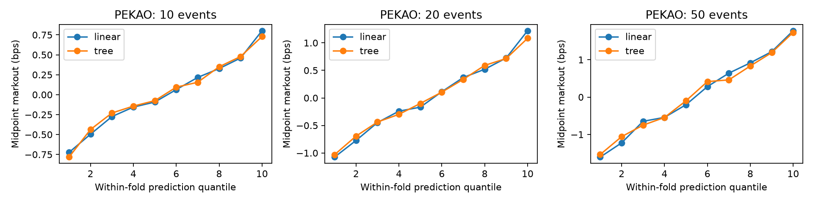

# Licensed real-data benchmark: PEKAO, January 2017

Completed 2026-09-14 UTC. Implementation: `1cba47bd325cb8e315cc3fce41b3b0044122e690`.

## Result in plain language

Book imbalance contains positive held-out midpoint-ranking information in this
bounded sample. Adding OFI and microprice produces smaller incremental gains.
The linear model has slightly higher pooled IC than the tree at all three
horizons. This is not evidence of realized trading profit or a statistically
established difference between models. No parameters or dates were changed
after observing results.

## Permission, provenance and population

Data: Marszałek, Adam (2023), *WSELOB-2017*, Mendeley Data V1,
[DOI 10.17632/3g4mhdp899.1](https://data.mendeley.com/datasets/3g4mhdp899/1),
licensed [CC BY 4.0](https://creativecommons.org/licenses/by/4.0/).
These aggregate results are shared under CC BY 4.0, as-is without warranty or
endorsement. Modifications: order replay, ten-level feature construction,
message-horizon labels, chronological evaluation and aggregate reporting.
See [permission and schema evidence](WSELOB_LICENSE.md).

FI-2010 was examined first but not used: reliable cross-feature scaling and
stock boundaries were unresolved. The selected WSELOB file supplies explicit
daily keys and instrument identity. PEKAO was selected because it is the
smallest distributed stock file, before any predictive results were observed.
The first ten trading days were fixed before fitting; no full-year claim is made.

- Instrument: PEKAO, source `symbol_idx=11322`.
- Dates: January 2, 3, 4, 5, 9, 10, 11, 12, 13 and 16, 2017.
- Window: 10:00 inclusive to 16:00 exclusive, Europe/Warsaw each day.
- Source rows across these days: **480,321**; retained snapshots: **336,602**.
- All source messages before the window are replayed to initialize the book.
- Unknown modify/delete identities, duplicate adds, mixed instruments and
  time/date disagreement cause conversion to fail. Conversion completed.
- Each selected day begins with an explicit reset. Price is `price/10**price_level`;
  missing modification fields retain their previous values before scaling.
- No unpriced-order, shallow, locked or crossed snapshots occurred inside the
  selected window. Every day yielded one uninterrupted segment. Excluded rows
  were outside the fixed window; their per-day counts are in metadata.
- Raw file SHA256: `3c418a55a492ebe2e39c8513cd7fc7e3e6827dc1a176af09fdcaad9f3485bae6`.
- Raw and processed observations are not committed. Artifact metadata records
  the processed-input hash, exact day keys and replay counts.

## Evaluation contract

Each snapshot is the state after one source message. Horizons are **10, 20 or
50 subsequent source messages**, not seconds. Labels are `10000*(future_mid/mid-1)`.
They stop at stock/day/segment boundaries. The first lag-dependent feature row
and last horizon rows are excluded separately within each segment.

Train on all selected earlier days and test on the next day: nine held-out days,
January 3–16. No label crosses into a later day. All feature sets and models use
the same eligible rows for each horizon. Features contain no future columns.

Linear: train-only standardization and ridge coefficient `1e-6`. Tree:
HistGradientBoostingRegressor, depth 3, minimum leaf 25, up to 200 iterations,
learning rate 0.03, seed 7, scikit-learn default early-stopping behavior confined
to training days. No hyperparameter search. Shuffled controls permute training
labels only; the same fold permutation is reused across feature sets/models.
One seed is a negative control, not a permutation significance test.

Adjacent labels overlap. Rows are not independent observations. We report
daily IC and nine held-out dates, but do not assume days are independent either.
There are no IID p-values, confidence intervals or annualized performance claims.

## Full-feature results

IC is pooled held-out Spearman correlation. Direction accuracy excludes zero
realized moves. Coverage is the fraction with `abs(prediction)>1 bp`.
The final column averages `sign(prediction)*markout-1 bp` over selected rows only.
It is a thresholded midpoint diagnostic, **not execution PnL**: entry/exit spreads,
fees, queue position, inventory, latency and overlapping positions are unmodeled.

| Messages | Model | Held-out rows | IC | Direction accuracy | Coverage | Selected diagnostic, bps |
| ---: | --- | ---: | ---: | ---: | ---: | ---: |
| 10 | Linear | 314,714 | 0.2361 | 68.23% | 0.60% | -0.0856 |
| 10 | Tree | 314,714 | 0.2312 | 67.60% | 4.86% | -0.1479 |
| 20 | Linear | 314,624 | 0.2712 | 66.52% | 17.30% | 0.1217 |
| 20 | Tree | 314,624 | 0.2584 | 65.51% | 17.66% | 0.0738 |
| 50 | Linear | 314,354 | 0.2758 | 63.73% | 46.95% | 0.3566 |
| 50 | Tree | 314,354 | 0.2606 | 62.53% | 43.27% | 0.3391 |

### Shuffled-label controls, same rows and dates

| Messages | Model | IC | Direction accuracy |
| ---: | --- | ---: | ---: |
| 10 | Linear | -0.0251 | 48.07% |
| 10 | Tree | -0.0104 | 48.59% |
| 20 | Linear | -0.0087 | 49.82% |
| 20 | Tree | -0.0024 | 50.05% |
| 50 | Linear | -0.0497 | 49.73% |
| 50 | Tree | -0.0422 | 50.29% |

All tree controls and the 10-message linear control select no rows at 1 bp.
The other linear controls select only 3 and 8 rows respectively; their diagnostic
means are not stable estimates. Full precision and coverage are in the CSV.

### Daily rather than row-count evidence

| Messages | Model | Equal-weight mean daily IC | Daily IC range | Positive-IC days |
| ---: | --- | ---: | --- | ---: |
| 10 | Linear | 0.2480 | 0.2047–0.2826 | 9/9 |
| 10 | Tree | 0.2449 | 0.1802–0.2902 | 9/9 |
| 20 | Linear | 0.2842 | 0.2414–0.3250 | 9/9 |
| 20 | Tree | 0.2755 | 0.2036–0.3297 | 9/9 |
| 50 | Linear | 0.2908 | 0.2435–0.3294 | 9/9 |
| 50 | Tree | 0.2775 | 0.2326–0.3357 | 9/9 |

This describes temporal consistency within the selected sample, not significance
or robustness to later market regimes. Daily control metrics are also published.

## Feature ablation: pooled IC

Each column adds features cumulatively. Imbalance includes top-of-book and
ten-level depth imbalance. OFI is normalized L1 snapshot OFI; microprice adds
microprice displacement in bps. No trade-flow features are used.

| Messages | Model | Spread | + Imbalance | + OFI | + Microprice |
| ---: | --- | ---: | ---: | ---: | ---: |
| 10 | Linear | -0.0003 | 0.2309 | 0.2326 | 0.2361 |
| 10 | Tree | -0.0039 | 0.2200 | 0.2291 | 0.2312 |
| 20 | Linear | -0.0066 | 0.2651 | 0.2663 | 0.2712 |
| 20 | Tree | -0.0073 | 0.2511 | 0.2573 | 0.2584 |
| 50 | Linear | -0.0052 | 0.2729 | 0.2740 | 0.2758 |
| 50 | Tree | -0.0076 | 0.2531 | 0.2596 | 0.2606 |

## Within-fold prediction quantiles

Prediction deciles are assigned separately inside each held-out fold before
aggregating realized markouts. Ties remain together. Every aggregate decile in
this run contains all nine folds; the per-fold counts are published.

| Messages | Model | Bottom-decile markout, bps | Top-decile markout, bps | Increasing adjacent steps |
| ---: | --- | ---: | ---: | ---: |
| 10 | Linear | -0.7246 | 0.8026 | 9/9 |
| 10 | Tree | -0.7829 | 0.7294 | 9/9 |
| 20 | Linear | -1.0749 | 1.2210 | 9/9 |
| 20 | Tree | -1.0304 | 1.0832 | 9/9 |
| 50 | Linear | -1.6058 | 1.7771 | 9/9 |
| 50 | Tree | -1.5376 | 1.7313 | 9/9 |

These are row-weighted aggregates of within-fold assignments, not pooled
prediction cutoffs. Aggregate monotonicity does not assert every individual
day is monotonic or establish statistical significance.

## Reproduction and artifacts

Follow [the exact preparation and experiment commands](REAL_DATA_EXPERIMENT.md).
The run used `OMP_NUM_THREADS=2 OPENBLAS_NUM_THREADS=2`, Python 3.14.5,
NumPy 2.5.0, pandas 3.0.3, scikit-learn 1.9.1, PyArrow 24.0.0,
Matplotlib 3.11.2 and h5py 3.16.0. No downloaded source code was executed;
the adapter reads HDF5 numeric/byte tables directly, without deserializing
pickled pandas metadata.

Published in [results/wselob_pekao](../results/wselob_pekao):

- `model_metrics.csv`: full-feature models and negative controls.
- `feature_ablation.csv`: all four feature sets, including controls.
- `daily_metrics.csv`: each fold/day/model/feature set and control.
- `prediction_quantiles.csv` and `prediction_quantiles_by_fold.csv`.
- `prediction_quantile_markout.png`.
- `experiment_metadata.json`: source/processed hashes, config, folds and attribution.

Validation: full pytest **25 passed**, one existing pandas deprecation warning;
[implementation CI passed](https://github.com/DeepCogNeural/microstructure-lab/actions/runs/34802089276).
The real-data preparation and complete model run both exited successfully.

This closes the requested implementation/empirical work, not a new external
review. Do not merge to main or treat a numeric resume claim as reviewed until
the requested reviewer has assessed these exact results.
